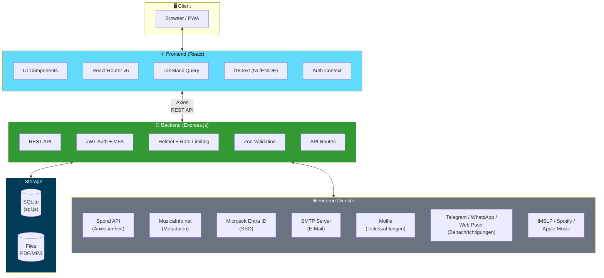

# Tutti Musik-App


*[English](README.md) · [Nederlandse versie](README.nl.md)*

Eine vollständige Webanwendung zur Verwaltung von Noten, Proben, Konzertprogrammen und der Mitgliederorganisation für Blasorchester und Brass Bands.

## Inhaltsverzeichnis

- [Überblick](#überblick)
- [Architektur](#architektur)
- [Funktionen](#funktionen)
- [Screenshots](#screenshots)
- [Installation](#installation)
- [Konfiguration](#konfiguration)
- [Entwicklung](#entwicklung)
- [Tests](#tests)
- [Deployment](#deployment)
- [API-Dokumentation](#api-dokumentation)
- [Projektstruktur](#projektstruktur)
- [Technologien](#technologien)
- [Lizenz](#lizenz)

## Überblick

Tutti ist eine mandantenfähige Webanwendung, die für Blasorchester, Brass Bands und Sinfonische Blasorchester entwickelt wurde. Die Anwendung zentralisiert die Verwaltung von Noten (PDFs), Probenplanung, Konzertprogrammen, Verleih von Notenmaterial und Mitgliederverwaltung. Mehrere Vereine können dieselbe Installation gemeinsam nutzen und optional Noten miteinander teilen.

### Kernfunktionen

- **Musikbibliothek** — PDFs hochladen, kategorisieren und auf Basis der Instrumente an Mitglieder verteilen
- **Proben & Anwesenheit** — Proben planen, Spond für automatische Anwesenheitserfassung einbinden
- **Konzertprogramme** — Setlists mit Zeitberechnung und Stücknummerierung erstellen
- **Mitgliederverwaltung** — Mitglieder, Instrumente, Orchester und Rollen verwalten
- **Metadaten-Anreicherung** — Spieldauer und Schwierigkeitsgrad automatisch über MusicaInfo.net abrufen
- **Mandantenfähig** — Unterstützung mehrerer Vereine auf einer einzigen Installation

## Architektur



### Systemkomponenten

```mermaid
flowchart LR
    subgraph FE["Frontend-Module"]
        Pages["📄 51 Pages"]
        Components["🧩 61 Components"]
        Hooks["🪝 32 Custom Hooks"]
        Utils["🔧 Utilities"]
    end

    subgraph BE["Backend-Module"]
        AuthRoutes["🔐 Auth Routes"]
        MusicRoutes["🎵 Music Routes"]
        UserRoutes["👥 User Routes"]
        AdminRoutes["⚙️ Admin Routes"]
    end

    subgraph DB["Datenbank (87 Tabellen)"]
        Users["users"]
        Music["music_pieces"]
        Lists["music_lists"]
        Orchestras["orchestras"]
        Rehearsals["rehearsals"]
        AuditLogs["audit_logs"]
    end

    FE --> BE
    BE --> DB
```



### Textdiagramm (Fallback)

```
┌─────────────────────────────────┐
│         Frontend (React)        │
│  Vite · TypeScript · TanStack   │
│  i18n (NL/EN/DE) · React Router │
└──────────────┬──────────────────┘
               │ REST API (Axios)
               ▼
┌─────────────────────────────────┐
│       Backend (Express.js)      │
│  TypeScript · JWT Auth · Helmet │
│  Rate Limiting · Zod Validation │
└──────────────┬──────────────────┘
               │
       ┌───────┴───────┐
       ▼               ▼
┌─────────────┐  ┌───────────┐
│   SQLite    │  │   Files   │
│  (sql.js)   │  │  PDF/MP3  │
└─────────────┘  └───────────┘
       │
       ▼
┌─────────────────────────────────────────┐
│         External Services               │
│  Spond · MusicaInfo · Entra ID · SMTP   │
│  Mollie · Telegram · WhatsApp · IMSLP   │
│  Spotify · Apple Music · Web Push       │
└─────────────────────────────────────────┘
```

### Designentscheidungen

| Entscheidung | Begründung |
|---|---|
| **SQLite statt PostgreSQL** | Kein separater Datenbankserver erforderlich; einfaches Backup (einzelne Datei); ausreichend für die typische Größenordnung eines Vereins |
| **sql.js statt better-sqlite3** | Keine native Kompilierung erforderlich; läuft auf jeder Plattform ohne Build-Tools |
| **Mandantenfähigkeit via association_id** | Jeder Verein hat eigene Daten, Instrumente und Einstellungen; optionales Teilen von Noten |
| **JWT-Authentifizierung** | Zustandslos, skalierbar; optional erweiterbar mit TOTP-MFA und Microsoft-SSO |
| **i18n mit i18next** | Mehrsprachige Unterstützung (Niederländisch, Englisch, Deutsch) für den internationalen Einsatz |

### Rollenmodell

| Rolle | Berechtigungen |
|---|---|
| `member` | Eigene Noten einsehen und herunterladen, Profil verwalten |
| `conductor` | Alle Berechtigungen von member + Proben und Konzertprogramme verwalten |
| `music_committee` | Alle Berechtigungen von conductor + Noten hochladen, Instrumente verwalten, Issues bearbeiten |
| `admin` | Vollständiger Zugriff: Mitgliederverwaltung, Einstellungen, Backup/Restore, Vereinskonfiguration |

## Funktionen

### Notenverwaltung

- **Hochladen** — PDFs per Drag-and-Drop in die Dropzone ziehen; Metadaten werden automatisch aus dem Dateinamen geparst (`Titel_Arrangeur_Instrument_Tonart_Gruppennummer_Schlüssel.pdf`)
- **Notenblätter** — Noten pro Instrument mit Filtern nach Titel, Instrument und Orchester
- **Notentitel** — Metadaten pro Titel: Komponist, Arrangeur, Genre, Spieldauer, Schwierigkeitsgrad, YouTube-Link
- **MusicaInfo.net-Integration** — Metadaten (Spieldauer, Schwierigkeitsgrad, Verlag) automatisch suchen und importieren
- **Instrumentenaliase** — Flexibles Instrument-Matching (z. B. „Altsax" → „Alto Saxophone Eb")
- **Teilen** — Notenblätter und Titel zwischen Vereinen teilen
- **MP3-Uploads** — Audioaufnahmen zu Notenblättern hinzufügen
- **PDF-Tools** — PDFs zusammenführen, Seiten extrahieren und transponieren

### Proben & Anwesenheit

- **Standard-Probentage** — Wiederkehrende Tage/Uhrzeiten pro Orchester festlegen
- **Probeninstanzen** — Automatisch generiert oder manuell erstellt (regulär/extra/abgesagt)
- **Spond-Integration** — Anwesenheitsdaten automatisch aus Spond synchronisieren
- **Anwesenheitsübersicht** — Pro Mitglied: Anzahl anwesend, abwesend, Prozentsatz (filterbar nach Datum und Orchester)

### Konzertprogramme & Notenlisten

- **Setlists** — Konzertprogramme pro Orchester mit Datum, Ort und Anmerkungen erstellen
- **Zeitberechnung** — Automatische Berechnung der Gesamtspieldauer
- **Musikkommission-Notizen** — Interne Anmerkungen zu Titeln (nur für Kommissionsmitglieder sichtbar)

### Mitgliederverwaltung

- **Benutzer** — Anlegen, bearbeiten, löschen mit Paginierung und Suchfunktion
- **Instrumente** — Mitgliedern mit Tonart und Notenschlüssel zuweisen
- **Orchester** — Mitglieder mehreren Orchestern zuordnen
- **Rollen** — Flexibles Rollensystem (member, conductor, music_committee, admin)

### Verleihverwaltung

- **Ausleihen** — Verleih von Notenmaterial an externe Organisationen erfassen
- **Statusverfolgung** — Aktiv, überfällig, zurückgegeben mit automatischen Statusaktualisierungen
- **Verfügbarkeit** — Überblick, welche Titel für den Verleih verfügbar sind

### Issues & Qualitätsmanagement

- **Meldungen** — Mitglieder können Fehler in Noten melden (falsche Noten, fehlende Seiten)
- **Workflow** — Statusverfolgung: offen → in Prüfung → gelöst/abgelehnt

### Konzerte & Ticketing

- **Konzertmanagement** — Konzerte mit Datum, Ort und Programm erstellen und verwalten
- **Ticketverkauf** — Tickets online verkaufen mit anpassbaren Preisen und Sitzkategorien
- **Öffentlicher Ticketshop** — Kundenorientierte Seite für den Ticketkauf
- **Ticket-Scanner** — QR-Code-Scanning zur Eingangskontrolle
- **Ticket-Übertragung** — Kunden können Tickets an andere übertragen
- **Gästeliste** — Verwaltung von Freikarten und VIP-Gästen
- **Zahlungseinstellungen** — Zahlungsanbieter und Preise konfigurieren
- **Ticket-Dashboard** — Verkaufsübersicht und Statistiken

### Sitzordnung & Orchesteraufstellung

- **Sitzpläne** — Visueller Editor für die Sitzordnung
- **Nachbarpräferenzen** — Mitglieder können Sitzpräferenzen angeben
- **Stimmgruppen** — Musiker nach Sektion/Stimmgruppe organisieren
- **Belegungsübersicht** — Einsicht, welche Plätze pro Probe/Konzert belegt sind

### Üben & Planung

- **Übepläne** — Individuelle oder Sektions-Übepläne erstellen und teilen
- **IMSLP-Browser** — Kostenlose Noten auf IMSLP.org suchen und verlinken

### Sicherheit & Authentifizierung

- **JWT-Token** — Sichere Authentifizierung mit konfigurierbarer Gültigkeitsdauer
- **TOTP-MFA** — Optionale Zwei-Faktor-Authentifizierung über Authenticator-App
- **Microsoft-SSO** — Azure Entra ID (ehemals Azure AD) Integration
- **Passwort-Reset** — Per E-Mail mit sicheren Token
- **Rate Limiting** — Schutz vor Brute-Force-Angriffen
- **Helmet** — HTTP-Sicherheitsheader

### Administration & Monitoring

- **Audit-Logs** — Sicherheitsprotokoll mit Benutzeraktionen
- **Sitzungsverwaltung** — Aktive Benutzersitzungen einsehen und beenden
- **Health-Dashboard** — Systemstatus und Leistungsüberwachung
- **Datenexport** — DSGVO-konformer Export personenbezogener Daten
- **Entra-Sync** — Automatische Benutzersynchronisierung mit Microsoft Entra ID

### Weitere Funktionen

- **Themes** — Anpassbare Farben und Branding pro Verein
- **Logo** — Vereinslogo hochladen
- **SMTP-Konfiguration** — E-Mail-Einstellungen pro Verein
- **Backup & Restore** — Vollständige Datenbank mit Dateien als ZIP herunterladen/hochladen
- **Aktivitätslog** — Nachverfolgen, wer was ansieht und herunterlädt
- **Statistiken** — Dashboard mit meistgesehenen und meistgeladenen Stücken
- **Changelog** — In-App-Versionshistorie
- **Onboarding-Tour** — Geführte Tour für neue Benutzer
- **Musiktools** — Eingebautes Metronom und Stimmgerät
- **WCAG 2.1 AA** — Barrierefreie Oberfläche mit Tastaturnavigation und korrektem Kontrastverhältnis

## Screenshots

| Dashboard | Notenblätter |
|---|---|
|  |  |

| Upload | Notenlisten |
|---|---|
|  |  |

## Installation

### Voraussetzungen

- **Node.js** 18+ (20+ empfohlen)
- **npm** 9+
- **Git**

### Schnellstart

```bash
# 1. Repository klonen
git clone https://github.com/ruudsl/tutti.git
cd tutti

# 2. Alle Abhängigkeiten installieren (Backend + Frontend)
npm install

# 3. Konfigurationsdateien erstellen
cp backend/.env.example backend/.env
cp frontend/.env.example frontend/.env.local

# 4. Backend-Konfiguration anpassen (siehe Konfiguration unten)
#    Mindestens: JWT_SECRET für den Produktionsbetrieb setzen

# 5. Entwicklungsserver starten (Backend + Frontend gleichzeitig)
npm run dev
```

Die Anwendung ist nun verfügbar unter:
- **Frontend:** http://localhost:5173
- **Backend-API:** http://localhost:3001

### Standardzugangsdaten

Beim ersten Start wird automatisch ein Admin-Konto angelegt:
- **E-Mail:** `admin@tutti.nl`
- **Passwort:** wird generiert und in der Konsolenausgabe angezeigt

Sie können auch vorab ein Passwort über die Umgebungsvariable `ADMIN_INIT_PASSWORD` festlegen.

> **Hinweis:** Ändern Sie das Passwort nach der ersten Anmeldung unter Profil → Passwort ändern!

## Konfiguration

### Backend (`backend/.env`)

| Variable | Standard | Beschreibung |
|---|---|---|
| `NODE_ENV` | `development` | `development` oder `production` |
| `PORT` | `3001` | Port für den API-Server |
| `JWT_SECRET` | *(nur Dev-Standard)* | **Im Produktionsbetrieb erforderlich!** Generieren mit `openssl rand -hex 32` |
| `JWT_EXPIRES_IN` | `7d` | Gültigkeitsdauer des JWT-Tokens (z. B. `1d`, `12h`) |
| `DB_PATH` | `./data/tutti.db` | Pfad zur SQLite-Datenbankdatei |
| `UPLOAD_DIR` | `./uploads` | Verzeichnis für hochgeladene PDF-Dateien |
| `MP3_UPLOAD_DIR` | `./uploads/mp3` | Verzeichnis für hochgeladene MP3-Dateien |
| `MAX_FILE_SIZE` | `52428800` | Maximale Dateigröße in Bytes (Standard 50 MB) |
| `FRONTEND_URL` | `http://localhost:5173` | Frontend-URL für die CORS-Konfiguration |
| `ADMIN_INIT_PASSWORD` | *(leer)* | Optional: Admin-Passwort beim ersten Start |
| `RATE_LIMIT_WINDOW_MS` | `900000` | Rate-Limit-Fenster in ms (Standard 15 Min.) |
| `RATE_LIMIT_MAX_REQUESTS` | `100` | Maximale Anfragen pro Fenster |
| `AUTH_RATE_LIMIT_MAX_REQUESTS` | `5` | Maximale Anmeldeversuche pro Fenster |

### Frontend (`frontend/.env.local`)

| Variable | Standard | Beschreibung |
|---|---|---|
| `VITE_API_URL` | *(leer = Proxy)* | Backend-API-URL. Für die Entwicklung leer lassen (Vite-Proxy). Im Produktionsbetrieb: vollständige URL, z. B. `https://api.example.com/api` |

## Entwicklung

### Befehle

```bash
# Backend + Frontend gleichzeitig starten
npm run dev

# Nur Backend
npm run dev --workspace=backend

# Nur Frontend
npm run dev --workspace=frontend

# Für den Produktionsbetrieb bauen
npm run build

# Datenbank neu initialisieren (Achtung: löscht alle Daten)
npm run db:init --workspace=backend
```

### Dateinamenformat

Notenblätter werden automatisch anhand des Dateinamens geparst:

```
Titel_Arrangeur_Instrument_Tonart_Gruppennummer_Schlüssel.pdf
```

Beispiele:
- `The Pacific_Ted Ricketts_Baritone_Bb__sol.pdf`
- `Shannon Song_Rowwen Heze_Alto Saxophone_Eb_1.pdf`
- `Shannon Song_Rowwen Heze_Altsax_Eb_2.pdf` (Alias wird erkannt)

## Tests

### Frontend-Tests

```bash
# Alle Frontend-Tests ausführen
npm test --workspace=frontend

# Watch-Modus (automatisches Neuladen bei Änderungen)
npm run test:watch --workspace=frontend
```

### Backend-Tests

```bash
# Alle Backend-Tests ausführen
npm test --workspace=backend

# Watch-Modus
npm run test:watch --workspace=backend
```

### Alle Tests

```bash
# CI-Stil: TypeScript-Prüfung + Tests + Build
npm test --workspace=frontend && npm test --workspace=backend
```

## Deployment

### Backend auf Render.com deployen

1. **Konto erstellen** auf [render.com](https://render.com) und anmelden

2. **„New" → „Web Service" klicken**

3. **GitHub-Repository verbinden** und das Tutti-Repository auswählen

4. **Service konfigurieren:**
   - **Name:** `tutti-backend`
   - **Region:** Frankfurt (EU Central)
   - **Root Directory:** `backend`
   - **Runtime:** Node
   - **Build Command:** `npm install && npm run build`
   - **Start Command:** `npm start`

5. **Umgebungsvariablen hinzufügen:**

   | Key | Value |
   |---|---|
   | `NODE_ENV` | `production` |
   | `PORT` | `10000` |
   | `JWT_SECRET` | *(generieren mit `openssl rand -hex 32`)* |
   | `DB_PATH` | `/opt/render/project/data/tutti.db` |
   | `UPLOAD_DIR` | `/opt/render/project/data/uploads` |
   | `MP3_UPLOAD_DIR` | `/opt/render/project/data/uploads/mp3` |
   | `FRONTEND_URL` | *(später nach Frontend-Deployment eintragen)* |

6. **Disk hinzufügen** für persistenten Speicher:
   - **Mount Path:** `/opt/render/project/data`
   - **Size:** 1 GB (oder mehr je nach Bedarf)

7. **„Create Web Service" klicken** und die URL notieren

### Frontend auf Vercel deployen

1. **Konto erstellen** auf [vercel.com](https://vercel.com) und anmelden

2. **GitHub-Repository importieren** über „Add New..." → „Project"

3. **Konfiguration:**
   - **Framework Preset:** Vite
   - **Root Directory:** `frontend`

4. **Umgebungsvariable:**

   | Key | Value |
   |---|---|
   | `VITE_API_URL` | Backend-URL + `/api`, z. B. `https://tutti-backend.onrender.com/api` |

5. **Deployen** und die Frontend-URL notieren

### Nach beiden Deployments

Zurück zu Render.com gehen und `FRONTEND_URL` auf die Vercel-URL setzen (für CORS).

### Fehlerbehebung

| Problem | Lösung |
|---|---|
| „Cannot GET /api" | Prüfen, ob `VITE_API_URL` korrekt ist (muss mit `/api` enden) |
| CORS-Fehler beim Login | `FRONTEND_URL` korrekt auf Render setzen (exakt, mit https://, ohne abschließenden Schrägstrich) |
| Backend startet nicht | Render-Logs prüfen; alle Umgebungsvariablen überprüfen |
| Daten nach Redeploy verloren | Disk mit dem korrekten Mount-Pfad hinzufügen |

## API-Dokumentation

### Authentifizierung

Alle Endpunkte (außer Login) erfordern einen JWT-Token im `Authorization`-Header:

```
Authorization: Bearer <token>
```

### Endpunktübersicht

| Gruppe | Pfad | Beschreibung |
|---|---|---|
| Auth | `/api/auth/*` | Login, Profil, Passwort, MFA, Passwort-Reset |
| Benutzer | `/api/users/*` | CRUD-Mitglieder, Instrumente/Orchester zuweisen |
| Instrumente | `/api/instruments/*` | CRUD-Instrumente und Aliase |
| Orchester | `/api/orchestras/*` | CRUD-Orchester, Mitgliederverwaltung |
| Notenblätter | `/api/music-pieces/*` | Hochladen, Herunterladen, Metadaten, MP3, Teilen |
| Notentitel | `/api/music-titles/*` | Metadaten-Bibliothek (über music-pieces-Routen) |
| Notenlisten | `/api/music-lists/*` | Setlists und Konzertprogramme |
| Genres | `/api/genres/*` | Musikgenres/-kategorien |
| Proben | `/api/rehearsals/*` | Planung, Standardtage, Anwesenheit |
| Spond | `/api/spond/*` | Spond-Konfiguration und Synchronisierung |
| Ausleihen | `/api/loans/*` | Verleihverwaltung |
| Issues | `/api/issues/*` | Fehlermeldungen für Noten |
| Aktivität | `/api/activity/*` | Protokollierung und Statistiken |
| MusicaInfo | `/api/musicainfo/*` | Metadatensuche über MusicaInfo.net |
| PDF-Tools | `/api/pdf-tools/*` | PDF zusammenführen, extrahieren, transponieren |
| Einstellungen | `/api/settings/*` | Vereinseinstellungen, Theme, SMTP |
| Backup | `/api/backup/*` | Datenbank-Backup und -Restore |
| Microsoft | `/api/microsoft-auth/*` | Azure Entra SSO |

## Projektstruktur

```
tutti/
├── backend/
│   ├── src/
│   │   ├── config.ts              # Konfiguration und Umgebungsvariablen
│   │   ├── index.ts               # Express-Server-Einstiegspunkt
│   │   ├── database/
│   │   │   ├── connection.ts      # SQLite-Verbindung (sql.js-Wrapper)
│   │   │   ├── schema.ts          # Datenbankschema (87 Tabellen)
│   │   │   └── init.ts            # Initialisierungsskript
│   │   ├── middleware/
│   │   │   ├── auth.ts            # JWT-Authentifizierung & -Autorisierung
│   │   │   └── errorHandler.ts    # Zentrale Fehlerbehandlung
│   │   ├── routes/                # 51 API-Routenmodule
│   │   │   ├── auth.ts            # Login, MFA, Passwort-Reset
│   │   │   ├── users.ts           # Mitgliederverwaltung
│   │   │   ├── instruments.ts     # Instrumente & Aliase
│   │   │   ├── orchestras.ts      # Orchester
│   │   │   ├── music-pieces.ts    # Notenblätter (PDF)
│   │   │   ├── music-lists.ts     # Konzertprogramme
│   │   │   ├── rehearsals.ts      # Proben & Anwesenheit
│   │   │   ├── spond.ts           # Spond-Integration
│   │   │   ├── loans.ts           # Verleihverwaltung
│   │   │   ├── issues.ts          # Meldungen
│   │   │   ├── musicainfo.ts      # MusicaInfo.net-Scraper
│   │   │   ├── pdf-tools.ts       # PDF-Manipulation
│   │   │   ├── settings.ts        # Vereinseinstellungen
│   │   │   ├── backup.ts          # Backup & Restore
│   │   │   ├── activity.ts        # Aktivitätslog
│   │   │   ├── genres.ts          # Genres
│   │   │   ├── associations.ts    # Mandantenverwaltung
│   │   │   └── microsoft-auth.ts  # Azure SSO
│   │   ├── services/
│   │   │   └── spond.ts           # Spond-API-Client
│   │   └── utils/
│   │       ├── database.ts        # Transaktionen & Paginierungs-Helfer
│   │       ├── email.ts           # SMTP-E-Mail-Versand
│   │       └── logger.ts          # Winston-Logging
│   ├── data/                      # SQLite-Datenbank (generiert)
│   ├── uploads/                   # Hochgeladene PDF/MP3-Dateien
│   └── package.json
├── frontend/
│   ├── src/
│   │   ├── api.ts                 # Axios-API-Client mit allen Endpunkten
│   │   ├── types.ts               # TypeScript-Typdefinitionen
│   │   ├── App.tsx                # Root-Komponente mit Routing
│   │   ├── pages/                 # 51 Seitenkomponenten
│   │   ├── components/            # 61 wiederverwendbare Komponenten
│   │   ├── hooks/                 # 32 benutzerdefinierte React-Hooks
│   │   ├── context/               # Auth-Context (Anmeldestatus)
│   │   ├── lib/                   # React-Query-Konfiguration
│   │   ├── utils/                 # Hilfsfunktionen mit Tests
│   │   ├── locales/               # i18n-Übersetzungen (NL, EN, DE)
│   │   └── test/                  # Test-Setup
│   └── package.json
├── .github/workflows/ci.yml      # GitHub Actions CI/CD
├── LICENSE                        # MIT-Lizenz
└── package.json                   # Workspace-Root (npm workspaces)
```

## Technologien

### Backend

| Technologie | Version | Zweck |
|---|---|---|
| Node.js | 20+ | Laufzeitumgebung |
| Express | 4.x | HTTP-Framework |
| TypeScript | 5.x | Typsicherheit |
| sql.js | 1.x | SQLite-Datenbank (WASM) |
| JWT (jsonwebtoken) | 9.x | Authentifizierung |
| Zod | 4.x | Anfrage-Validierung |
| Cheerio | 1.x | HTML-Parsing (MusicaInfo-Scraper) |
| Winston | 3.x | Logging |
| Helmet | 8.x | HTTP-Sicherheitsheader |
| Multer | 1.x | Datei-Uploads |
| pdf-lib | 1.x | PDF-Manipulation |
| Nodemailer | 7.x | E-Mail-Versand |
| otplib | 13.x | TOTP-MFA |
| Vitest | 3.x | Unit- & Integrationstests |

### Frontend

| Technologie | Version | Zweck |
|---|---|---|
| React | 18.x | UI-Framework |
| TypeScript | 5.x | Typsicherheit |
| Vite | 5.x | Build-Tool & Entwicklungsserver |
| React Router | 6.x | Clientseitiges Routing |
| TanStack Query | 5.x | Server-State-Management |
| Axios | 1.x | HTTP-Client |
| i18next | 25.x | Internationalisierung (NL/EN/DE) |
| React Hook Form | 7.x | Formularverwaltung |
| Zod | 4.x | Formularvalidierung |
| pdfjs-dist | 4.x | PDF-Vorschau-Rendering |
| Vitest | 4.x | Unit-Tests |
| Testing Library | 16.x | Komponententests |

## Lizenz

[MIT](LICENSE)
