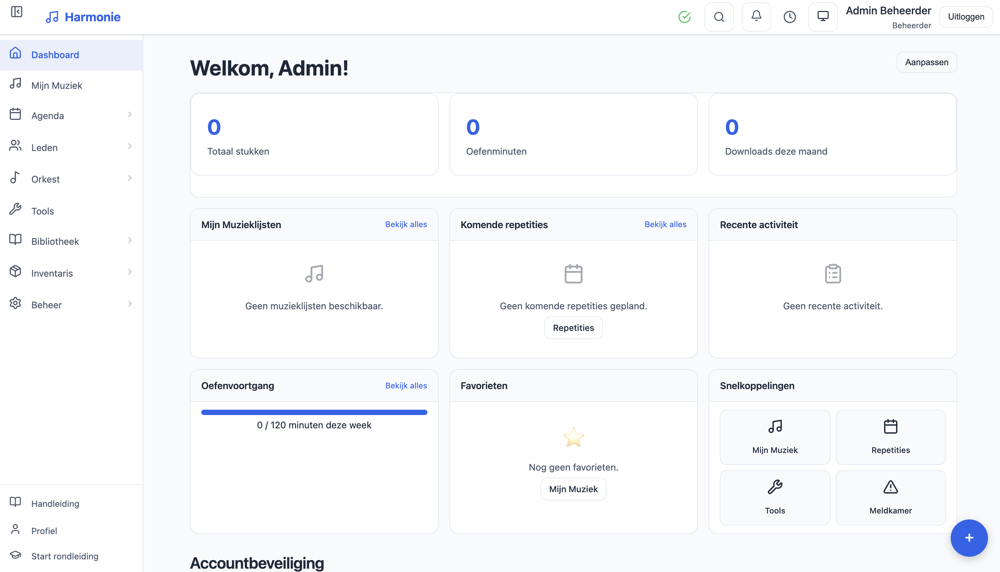
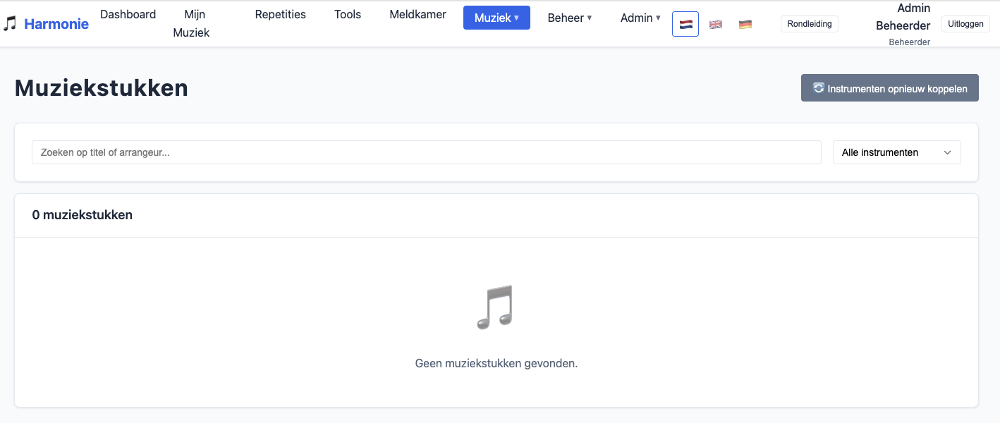
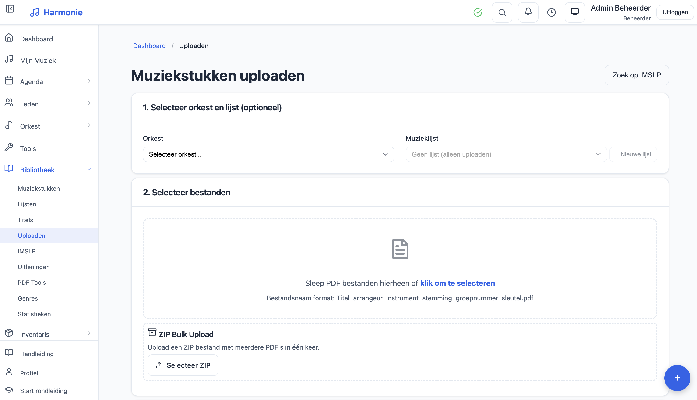
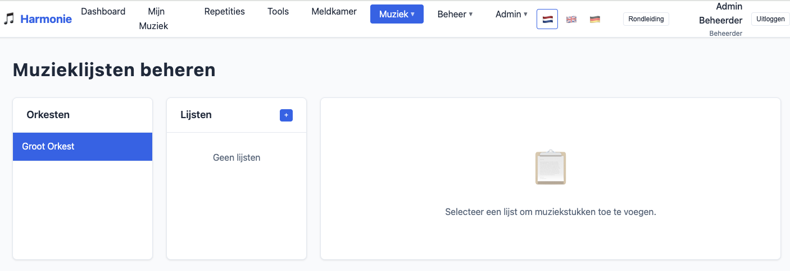

# Tutti Musik-App

[](https://github.com/ruudsl/tutti/actions/workflows/ci.yml)
[](https://github.com/ruudsl/tutti/actions/workflows/codeql.yml)
[](https://codecov.io/gh/ruudsl/tutti)


_[English](README.md) · [Nederlandse versie](README.nl.md)_

Eine vollständige Webanwendung zur Verwaltung von Noten, Proben, Konzertprogrammen und der Mitgliederorganisation für Blasorchester und Brass Bands.

## Überblick

Tutti ist eine mandantenfähige Webanwendung, die für Blasorchester, Brass Bands und Sinfonische Blasorchester entwickelt wurde. Die Anwendung zentralisiert die Verwaltung von Noten (PDFs), Probenplanung, Konzertprogrammen, Verleih von Notenmaterial und Mitgliederverwaltung.

### Kernfunktionen

- **Musikbibliothek** — PDFs hochladen, kategorisieren und auf Basis der Instrumente an Mitglieder verteilen
- **Proben & Anwesenheit** — Proben planen, Spond für automatische Anwesenheitserfassung einbinden
- **Konzertprogramme** — Setlists mit Zeitberechnung und Stücknummerierung erstellen
- **Mitgliederverwaltung** — Mitglieder, Instrumente, Orchester und Rollen verwalten
- **Tickets & Konzerte** — Online-Ticketverkauf mit QR-Scanning und Sitzplatzverwaltung
- **Mandantenfähig** — Unterstützung mehrerer Vereine auf einer einzigen Installation

Siehe [docs/FEATURES.md](docs/FEATURES.md) für die vollständige Funktionsliste.

## Screenshots

| Dashboard                                    | Musikstücke                                       |
| -------------------------------------------- | ------------------------------------------------- |
|  |  |

| Hochladen                                 | Musiklisten                                      |
| ----------------------------------------- | ------------------------------------------------ |
|  |  |

## Schnellstart

### Voraussetzungen

- **Node.js** 18+ (20+ empfohlen)
- **npm** 9+

### Installation

```bash
# Repository klonen
git clone https://github.com/ruudsl/tutti.git
cd tutti

# Abhängigkeiten installieren
npm install

# Konfiguration erstellen (siehe .env.example für alle 69 dokumentierten Variablen)
cp backend/.env.example backend/.env

# Entwicklungsserver starten
npm run dev
```

Die Anwendung ist jetzt verfügbar unter:

- **Frontend:** http://localhost:5173
- **Backend API:** http://localhost:3001

### Standard-Anmeldedaten

Beim ersten Start wird automatisch ein Admin-Konto erstellt:

- **E-Mail:** `admin@harmonie.nl`
- **Passwort:** Generiert und in der Konsolenausgabe angezeigt

Sie können ein Passwort über die Umgebungsvariable `ADMIN_INIT_PASSWORD` voreinstellen.

## Entwicklung

```bash
# Backend + Frontend zusammen starten
npm run dev

# Nur Backend
npm run dev --workspace=backend

# Nur Frontend
npm run dev --workspace=frontend

# Tests ausführen
npm test --workspace=backend
npm test --workspace=frontend

# Produktions-Build
npm run build
```

### Dateinamenformat für Musik-Uploads

```
Titel_Arrangeur_Instrument_Tonart_Gruppennummer_Schlüssel.pdf
```

Beispiele:

- `The Pacific_Ted Ricketts_Bariton_Bb__sol.pdf`
- `Shannon Song_Rowwen Heze_Altsaxophon_Eb_1.pdf`

## Deployment

### Empfohlenes Setup

| Komponente | Plattform                        |
| ---------- | -------------------------------- |
| Frontend   | [Vercel](https://vercel.com)     |
| Backend    | [Render.com](https://render.com) |

Siehe [docs/DEPLOYMENT.md](docs/DEPLOYMENT.md) für detaillierte Deployment-Anleitungen.

### Docker

```bash
cp .env.example .env
# .env mit Ihren Einstellungen bearbeiten
docker-compose up -d
```

Siehe [docs/SELF_HOSTING.md](docs/SELF_HOSTING.md) für Self-Hosting-Optionen.

## Dokumentation

### Benutzerdokumentation

| Dokument                                            | Beschreibung                                    |
| --------------------------------------------------- | ----------------------------------------------- |
| [USER_GUIDE.md](docs/USER_GUIDE.md)                 | Vollständige Benutzeranleitung (Niederländisch) |
| [FEATURES.md](docs/FEATURES.md)                     | Vollständige Funktionsliste                     |
| [KEYBOARD_SHORTCUTS.md](docs/KEYBOARD_SHORTCUTS.md) | Tastenkürzel-Referenz                           |
| [MOBILE_APP.md](docs/MOBILE_APP.md)                 | Mobile App / PWA-Anleitung                      |
| [FAQ.md](docs/FAQ.md)                               | Häufig gestellte Fragen (Niederländisch)        |
| [TROUBLESHOOTING.md](docs/TROUBLESHOOTING.md)       | Fehlerbehebung (Niederländisch)                 |

### Administration & Betrieb

| Dokument                                        | Beschreibung                                |
| ----------------------------------------------- | ------------------------------------------- |
| [ADMIN.md](docs/ADMIN.md)                       | Administrationshandbuch                     |
| [ROLE_PERMISSIONS.md](docs/ROLE_PERMISSIONS.md) | Rollenbasierte Berechtigungsmatrix          |
| [DEPLOYMENT.md](docs/DEPLOYMENT.md)             | Deployment-Anleitung (Render/Vercel/Docker) |
| [SELF_HOSTING.md](docs/SELF_HOSTING.md)         | Self-Hosting-Anleitung                      |
| [MONITORING.md](docs/MONITORING.md)             | Monitoring & Observability                  |

### Entwicklerdokumentation

| Dokument                                        | Beschreibung                        |
| ----------------------------------------------- | ----------------------------------- |
| [ARCHITECTURE.md](docs/ARCHITECTURE.md)         | Systemarchitektur                   |
| [DATABASE.md](docs/DATABASE.md)                 | Datenbankschema & ERD               |
| [API.md](docs/API.md)                           | REST-API-Dokumentation              |
| [AUTHENTICATION.md](docs/AUTHENTICATION.md)     | Authentifizierungsabläufe & JWT/MFA |
| [WEBSOCKET.md](docs/WEBSOCKET.md)               | WebSocket-Events-Referenz           |
| [STATE_MANAGEMENT.md](docs/STATE_MANAGEMENT.md) | Frontend-State-Patterns             |
| [HOOKS.md](docs/HOOKS.md)                       | React-Hooks-Dokumentation           |
| [TESTING.md](docs/TESTING.md)                   | Teststrategie & Richtlinien         |
| [THEMING.md](docs/THEMING.md)                   | Theming-System                      |

### Integration & Compliance

| Dokument                                      | Beschreibung                    |
| --------------------------------------------- | ------------------------------- |
| [INTEGRATIONS.md](docs/INTEGRATIONS.md)       | Externe Integrationen           |
| [GDPR.md](docs/GDPR.md)                       | DSGVO-Compliance-Anleitung      |
| [EMAIL_TEMPLATES.md](docs/EMAIL_TEMPLATES.md) | E-Mail-Vorlagen-Referenz        |
| [PRINT_TEMPLATES.md](docs/PRINT_TEMPLATES.md) | Druckvorlagen (Tickets, Poster) |

### Architekturentscheidungen

Siehe [docs/adr/](docs/adr/) für Architecture Decision Records (ADRs).

### API-Tests

Importieren Sie die [Postman-Sammlung](docs/postman/tutti-api-collection.json) für interaktive API-Tests.

## Sicherheit

Siehe [SECURITY.md](SECURITY.md) für unsere Sicherheitsrichtlinie und das Melden von Schwachstellen.

## Tech Stack

| Backend         | Frontend           |
| --------------- | ------------------ |
| Node.js 20+     | React 18           |
| Express 4.x     | Vite 5.x           |
| TypeScript 5.x  | TanStack Query 5.x |
| SQLite (sql.js) | React Router 6.x   |
| JWT + TOTP MFA  | i18next (NL/EN/DE) |

Siehe [docs/ARCHITECTURE.md](docs/ARCHITECTURE.md) für die vollständige Technologieliste.

## Lizenz

[MIT](LICENSE)
