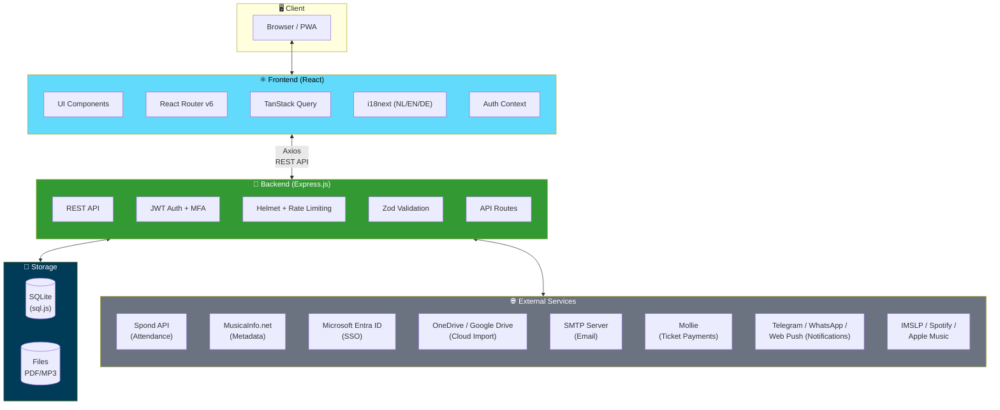

# Tutti Music App

[](https://github.com/ruudsl/tutti/actions/workflows/ci.yml)
[](https://github.com/ruudsl/tutti/actions/workflows/codeql.yml)
[](https://codecov.io/gh/ruudsl/tutti)


*[Nederlandse versie](README.nl.md) · [Deutsche Version](README.de.md)*

A complete web application for managing sheet music, rehearsals, concert programs, and member organization for concert bands and brass bands.

## Table of Contents

- [Overview](#overview)
- [Architecture](#architecture)
- [Features](#features)
- [Screenshots](#screenshots)
- [Installation](#installation)
- [Configuration](#configuration)
- [Development](#development)
- [Testing](#testing)
- [Deployment](#deployment)
- [API Documentation](#api-documentation)
- [Project Structure](#project-structure)
- [Technologies](#technologies)
- [License](#license)

## Overview

Tutti is a multi-tenant web application designed for concert bands, brass bands, and wind orchestras. The application centralizes the management of sheet music (PDFs), rehearsal schedules, concert programs, music material loans, and member management. Multiple organizations can share the same installation and optionally share music with each other.

### Core Features

- **Music Library** — Upload, categorize, and distribute PDF sheet music to members based on their instruments
- **Rehearsals & Attendance** — Schedule rehearsals, integrate with Spond for automatic attendance tracking
- **Concert Programs** — Create setlists with time calculations and piece numbering
- **Member Management** — Manage members, instruments, orchestras, and roles
- **Metadata Enrichment** — Automatically fetch duration and difficulty level via MusicaInfo.net
- **Multi-tenant** — Support for multiple organizations on a single installation

## Architecture



### System Components

```mermaid
flowchart LR
    subgraph FE["Frontend Modules"]
        Pages["📄 51 Pages"]
        Components["🧩 61 Components"]
        Hooks["🪝 32 Custom Hooks"]
        Utils["🔧 Utilities"]
    end

    subgraph BE["Backend Modules"]
        AuthRoutes["🔐 Auth Routes"]
        MusicRoutes["🎵 Music Routes"]
        UserRoutes["👥 User Routes"]
        AdminRoutes["⚙️ Admin Routes"]
    end

    subgraph DB["Database (87 Tables)"]
        Users["users"]
        Music["music_pieces"]
        Lists["music_lists"]
        Orchestras["orchestras"]
        Rehearsals["rehearsals"]
        AuditLogs["audit_logs"]
    end

    FE --> BE
    BE --> DB
```



### Text Diagram (fallback)

```
┌─────────────────────────────────┐
│         Frontend (React)        │
│  Vite · TypeScript · TanStack   │
│  i18n (NL/EN/DE) · React Router │
└──────────────┬──────────────────┘
               │ REST API (Axios)
               ▼
┌─────────────────────────────────┐
│       Backend (Express.js)      │
│  TypeScript · JWT Auth · Helmet │
│  Rate Limiting · Zod Validation │
└──────────────┬──────────────────┘
               │
       ┌───────┴───────┐
       ▼               ▼
┌─────────────┐  ┌───────────┐
│   SQLite    │  │   Files   │
│  (sql.js)   │  │  PDF/MP3  │
└─────────────┘  └───────────┘
       │
       ▼
┌─────────────────────────────────────────┐
│         External Services               │
│  Spond · MusicaInfo · Entra ID · SMTP   │
│  OneDrive · Google Drive · Mollie       │
│  Telegram · WhatsApp · IMSLP · Web Push │
└─────────────────────────────────────────┘
```

### Design Decisions

| Decision | Rationale |
|---|---|
| **SQLite instead of PostgreSQL** | No separate database server needed; simple backup (single file); sufficient for typical organization scale |
| **sql.js instead of better-sqlite3** | No native compilation required; runs on any platform without build tools |
| **Multi-tenant via association_id** | Each organization has its own data, instruments, and settings; optional music sharing |
| **JWT authentication** | Stateless, scalable; optionally extendable with TOTP MFA and Microsoft SSO |
| **i18n with i18next** | Multilingual support (Dutch, English, German) for international use |

### Role Model

| Role | Permissions |
|---|---|
| `member` | View and download own sheet music, manage profile |
| `conductor` | All member permissions + manage rehearsals and concert programs |
| `music_committee` | All conductor permissions + upload music, manage instruments, handle issues |
| `admin` | Full access: member management, settings, backup/restore, organization configuration |

## Features

### Music Management

- **Upload** — Drag and drop PDFs to the dropzone; metadata is automatically parsed from the filename (`Title_arranger_instrument_key_groupnumber_clef.pdf`)
- **Cloud Import** — Import sheet music directly from OneDrive/SharePoint or Google Drive without downloading first
- **Music Pieces** — Sheet music per instrument with filters on title, instrument, and orchestra
- **Music Titles** — Metadata per title: composer, arranger, genre, duration, difficulty level, YouTube link
- **MusicaInfo.net Integration** — Search and import metadata (duration, difficulty, publisher) automatically
- **Instrument Aliases** — Flexible instrument matching (e.g., "Altsax" → "Alto Saxophone Eb")
- **Sharing** — Share music pieces and titles between organizations
- **MP3 Uploads** — Add audio recordings to music pieces
- **PDF Tools** — Merge, extract pages, and transpose PDFs

### Rehearsals & Attendance

- **Default Rehearsal Days** — Set recurring days/times per orchestra
- **Rehearsal Instances** — Automatically generated or manually created (regular/extra/cancelled)
- **Spond Integration** — Sync attendance data automatically from Spond
- **Attendance Overview** — Per member: times present, absent, percentage (filterable by date and orchestra)

### Concert Programs & Music Lists

- **Setlists** — Create concert programs per orchestra with date, location, and notes
- **Time Calculation** — Automatic calculation of total playing time
- **Music Committee Notes** — Internal notes on titles (visible only to committee members)

### Member Management

- **Users** — Create, edit, delete with pagination and search functionality
- **Instruments** — Assign to members with key and clef
- **Orchestras** — Link members to multiple orchestras
- **Roles** — Flexible role system (member, conductor, music_committee, admin)

### Loan Management

- **Loans** — Register loans of music material to external organizations
- **Status Tracking** — Active, overdue, returned with automatic status updates
- **Availability** — Overview of which titles are available for loan

### Issues & Quality Management

- **Reports** — Members can report errors in sheet music (wrong notes, missing pages)
- **Workflow** — Status tracking: open → in review → resolved/rejected

### Concerts & Ticketing

- **Concert Management** — Create and manage concerts with date, location, and program
- **Ticket Sales** — Sell tickets online with customizable pricing and seat categories
- **Public Ticket Shop** — Customer-facing ticket purchase page
- **Ticket Scanner** — QR code scanning for entrance validation
- **Ticket Transfers** — Allow customers to transfer tickets to others
- **Guest List** — Manage complimentary tickets and VIP guests
- **Payment Settings** — Configure payment providers and pricing
- **Ticket Dashboard** — Sales overview and statistics

### Seating & Orchestra Layout

- **Seating Charts** — Visual seating arrangement editor
- **Neighbor Preferences** — Members can indicate seating preferences
- **Voice Parts** — Organize musicians by section/voice part
- **Occupancy Overview** — See which seats are filled per rehearsal/concert

### Practice & Scheduling

- **Practice Schedules** — Create and share individual or section practice schedules
- **IMSLP Browser** — Search and link to free sheet music on IMSLP.org

### Security & Authentication

- **JWT Tokens** — Secure authentication with configurable validity period
- **TOTP MFA** — Optional two-factor authentication via authenticator app
- **Microsoft SSO** — Azure Entra ID (formerly Azure AD) integration
- **Password Reset** — Via email with secure tokens
- **Rate Limiting** — Protection against brute-force attacks
- **Helmet** — HTTP security headers

### Administration & Monitoring

- **Audit Logs** — Security event logging with user actions
- **Session Management** — View and revoke active user sessions
- **Health Dashboard** — System status and performance monitoring
- **Data Export** — GDPR-compliant personal data export
- **Entra Sync** — Automatic user synchronization with Microsoft Entra ID

### Other Features

- **Themes** — Customizable colors and branding per organization
- **Logo** — Upload organization logo
- **SMTP Configuration** — Email settings per organization
- **Backup & Restore** — Download/upload complete database with files as ZIP
- **Activity Log** — Track who views and downloads what
- **Statistics** — Dashboard with top-viewed and downloaded pieces
- **Changelog** — In-app version history
- **Onboarding Tour** — Guided tour for new users
- **Music Tools** — Built-in metronome and tuner
- **WCAG 2.1 AA** — Accessible interface with keyboard navigation and contrast ratio

## Screenshots

| Dashboard | Music Pieces |
|---|---|
|  |  |

| Upload | Music Lists |
|---|---|
|  |  |

## Installation

### Requirements

- **Node.js** 18+ (20+ recommended)
- **npm** 9+
- **Git**

### Quick Start

```bash
# 1. Clone the repository
git clone https://github.com/ruudsl/tutti.git
cd tutti

# 2. Install all dependencies (backend + frontend)
npm install

# 3. Create configuration files
cp backend/.env.example backend/.env
cp frontend/.env.example frontend/.env.local

# 4. Adjust the backend configuration (see Configuration below)
#    At minimum: set a JWT_SECRET for production

# 5. Start the development server (backend + frontend together)
npm run dev
```

The application is now available at:
- **Frontend:** http://localhost:5173
- **Backend API:** http://localhost:3001

### Default Credentials

On first start, an admin account is automatically created:
- **Email:** `admin@tutti.nl`
- **Password:** generated and shown in console output

You can also preset a password via the environment variable `ADMIN_INIT_PASSWORD`.

> **Note:** Change the password after first login via Profile → Change Password!

## Configuration

### Backend (`backend/.env`)

| Variable | Default | Description |
|---|---|---|
| `NODE_ENV` | `development` | `development` or `production` |
| `PORT` | `3001` | Port for the API server |
| `JWT_SECRET` | *(dev-only default)* | **Required in production!** Generate with `openssl rand -hex 32` |
| `JWT_EXPIRES_IN` | `7d` | JWT token validity period (e.g., `1d`, `12h`) |
| `DB_PATH` | `./data/tutti.db` | Path to SQLite database file |
| `UPLOAD_DIR` | `./uploads` | Directory for uploaded PDF files |
| `MP3_UPLOAD_DIR` | `./uploads/mp3` | Directory for uploaded MP3 files |
| `MAX_FILE_SIZE` | `52428800` | Max file size in bytes (default 50MB) |
| `FRONTEND_URL` | `http://localhost:5173` | Frontend URL for CORS configuration |
| `ADMIN_INIT_PASSWORD` | *(empty)* | Optional: admin password on first start |
| `RATE_LIMIT_WINDOW_MS` | `900000` | Rate limit window in ms (default 15 min) |
| `RATE_LIMIT_MAX_REQUESTS` | `100` | Max requests per window |
| `AUTH_RATE_LIMIT_MAX_REQUESTS` | `5` | Max login attempts per window |

### Cloud Import Settings (in-app)

Cloud import settings are configured per organization via the Settings page:

**OneDrive/SharePoint:**
- Uses existing Microsoft Entra ID configuration
- Requires the `Files.Read.All` scope to be added to your Azure App Registration

**Google Drive:**
- Configure via Settings → Google Drive
- Requires a Google Cloud project with Picker API and Drive API enabled
- OAuth Client ID: Created in Google Cloud Console (Web Application type)
- API Key: Created in Google Cloud Console with Picker API access

### Frontend (`frontend/.env.local`)

| Variable | Default | Description |
|---|---|---|
| `VITE_API_URL` | *(empty = proxy)* | Backend API URL. Leave empty for development (Vite proxy). In production: full URL e.g., `https://api.example.com/api` |

## Development

### Commands

```bash
# Start backend + frontend simultaneously
npm run dev

# Backend only
npm run dev --workspace=backend

# Frontend only
npm run dev --workspace=frontend

# Build for production
npm run build

# Reinitialize database (warning: deletes all data)
npm run db:init --workspace=backend
```

### Filename Format

Music pieces are automatically parsed based on the filename:

```
Title_arranger_instrument_key_groupnumber_clef.pdf
```

Examples:
- `The Pacific_Ted Ricketts_Baritone_Bb__sol.pdf`
- `Shannon Song_Rowwen Heze_Alto Saxophone_Eb_1.pdf`
- `Shannon Song_Rowwen Heze_Altsax_Eb_2.pdf` (alias is recognized)

## Testing

### Frontend Tests

```bash
# Run all frontend tests
npm test --workspace=frontend

# Watch mode (auto-reload on changes)
npm run test:watch --workspace=frontend
```

### Backend Tests

```bash
# Run all backend tests
npm test --workspace=backend

# Watch mode
npm run test:watch --workspace=backend
```

### All Tests

```bash
# CI-style: TypeScript check + tests + build
npm test --workspace=frontend && npm test --workspace=backend
```

## Deployment

### Deploy Backend on Render.com

1. **Create an account** on [render.com](https://render.com) and log in

2. **Click "New" → "Web Service"**

3. **Connect your GitHub repository** and select the tutti repository

4. **Configure the service:**
   - **Name:** `tutti-backend`
   - **Region:** Frankfurt (EU Central)
   - **Root Directory:** `backend`
   - **Runtime:** Node
   - **Build Command:** `npm install && npm run build`
   - **Start Command:** `npm start`

5. **Add Environment Variables:**

   | Key | Value |
   |---|---|
   | `NODE_ENV` | `production` |
   | `PORT` | `10000` |
   | `JWT_SECRET` | *(generate with `openssl rand -hex 32`)* |
   | `DB_PATH` | `/opt/render/project/data/tutti.db` |
   | `UPLOAD_DIR` | `/opt/render/project/data/uploads` |
   | `MP3_UPLOAD_DIR` | `/opt/render/project/data/uploads/mp3` |
   | `FRONTEND_URL` | *(fill in later after frontend deployment)* |

6. **Add a Disk** for persistent storage:
   - **Mount Path:** `/opt/render/project/data`
   - **Size:** 1 GB (or more if needed)

7. **Click "Create Web Service"** and note the URL

### Deploy Frontend on Vercel

1. **Create an account** on [vercel.com](https://vercel.com) and log in

2. **Import your GitHub repository** via "Add New..." → "Project"

3. **Configuration:**
   - **Framework Preset:** Vite
   - **Root Directory:** `frontend`

4. **Environment Variable:**

   | Key | Value |
   |---|---|
   | `VITE_API_URL` | Backend URL + `/api`, e.g., `https://tutti-backend.onrender.com/api` |

5. **Deploy** and note the frontend URL

### After Both Deployments

Go back to Render.com and set `FRONTEND_URL` to the Vercel URL for CORS.

### Troubleshooting

| Problem | Solution |
|---|---|
| "Cannot GET /api" | Check if `VITE_API_URL` is correct (must end with `/api`) |
| CORS errors on login | Set `FRONTEND_URL` correctly on Render (exact, with https://, no trailing slash) |
| Backend won't start | Check the Render logs; verify all environment variables |
| Data lost after redeploy | Add a Disk with the correct mount path |

## API Documentation

### Authentication

All endpoints (except login) require a JWT token in the `Authorization` header:

```
Authorization: Bearer <token>
```

### Endpoints Overview

| Group | Path | Description |
|---|---|---|
| Auth | `/api/auth/*` | Login, profile, password, MFA, password reset |
| Users | `/api/users/*` | CRUD members, assign instruments/orchestras |
| Instruments | `/api/instruments/*` | CRUD instruments and aliases |
| Orchestras | `/api/orchestras/*` | CRUD orchestras, member management |
| Music Pieces | `/api/music-pieces/*` | Upload, download, metadata, MP3, sharing |
| Music Titles | `/api/music-titles/*` | Metadata library (via music-pieces routes) |
| Music Lists | `/api/music-lists/*` | Setlists and concert programs |
| Genres | `/api/genres/*` | Music genres/categories |
| Rehearsals | `/api/rehearsals/*` | Scheduling, default days, attendance |
| Spond | `/api/spond/*` | Spond configuration and synchronization |
| Loans | `/api/loans/*` | Loan management |
| Issues | `/api/issues/*` | Sheet music error reports |
| Activity | `/api/activity/*` | Logging and statistics |
| MusicaInfo | `/api/musicainfo/*` | Metadata lookup via MusicaInfo.net |
| PDF Tools | `/api/pdf-tools/*` | PDF merge, extract, transpose |
| Cloud Import | `/api/cloud-import/*` | OneDrive and Google Drive file import |
| Settings | `/api/settings/*` | Organization settings, theme, SMTP |
| Backup | `/api/backup/*` | Database backup and restore |
| Microsoft | `/api/microsoft-auth/*` | Azure Entra SSO |

## Project Structure

```
tutti/
├── backend/
│   ├── src/
│   │   ├── config.ts              # Configuration and environment variables
│   │   ├── index.ts               # Express server entry point
│   │   ├── database/
│   │   │   ├── connection.ts      # SQLite connection (sql.js wrapper)
│   │   │   ├── schema.ts          # Database schema (87 tables)
│   │   │   └── init.ts            # Initialization script
│   │   ├── middleware/
│   │   │   ├── auth.ts            # JWT authentication & authorization
│   │   │   └── errorHandler.ts    # Central error handling
│   │   ├── routes/                # 51 API route modules
│   │   │   ├── auth.ts            # Login, MFA, password reset
│   │   │   ├── users.ts           # Member management
│   │   │   ├── instruments.ts     # Instruments & aliases
│   │   │   ├── orchestras.ts      # Orchestras
│   │   │   ├── music-pieces.ts    # Music pieces (PDF)
│   │   │   ├── music-lists.ts     # Concert programs
│   │   │   ├── rehearsals.ts      # Rehearsals & attendance
│   │   │   ├── spond.ts           # Spond integration
│   │   │   ├── loans.ts           # Loan management
│   │   │   ├── issues.ts          # Reports
│   │   │   ├── musicainfo.ts      # MusicaInfo.net scraper
│   │   │   ├── pdf-tools.ts       # PDF manipulation
│   │   │   ├── settings.ts        # Organization settings
│   │   │   ├── backup.ts          # Backup & restore
│   │   │   ├── activity.ts        # Activity log
│   │   │   ├── genres.ts          # Genres
│   │   │   ├── associations.ts    # Multi-tenant management
│   │   │   └── microsoft-auth.ts  # Azure SSO
│   │   ├── services/
│   │   │   └── spond.ts           # Spond API client
│   │   └── utils/
│   │       ├── database.ts        # Transactions & pagination helpers
│   │       ├── email.ts           # SMTP email sending
│   │       └── logger.ts          # Winston logging
│   ├── data/                      # SQLite database (generated)
│   ├── uploads/                   # Uploaded PDF/MP3 files
│   └── package.json
├── frontend/
│   ├── src/
│   │   ├── api.ts                 # Axios API client with all endpoints
│   │   ├── types.ts               # TypeScript type definitions
│   │   ├── App.tsx                # Root component with routing
│   │   ├── pages/                 # 51 page components
│   │   ├── components/            # 61 reusable components
│   │   ├── hooks/                 # 32 custom React hooks
│   │   ├── context/               # Auth context (login state)
│   │   ├── lib/                   # React Query configuration
│   │   ├── utils/                 # Utility functions with tests
│   │   ├── locales/               # i18n translations (NL, EN, DE)
│   │   └── test/                  # Test setup
│   └── package.json
├── .github/workflows/ci.yml      # GitHub Actions CI/CD
├── LICENSE                        # MIT license
└── package.json                   # Workspace root (npm workspaces)
```

## Technologies

### Backend

| Technology | Version | Purpose |
|---|---|---|
| Node.js | 20+ | Runtime |
| Express | 4.x | HTTP framework |
| TypeScript | 5.x | Type safety |
| sql.js | 1.x | SQLite database (WASM) |
| JWT (jsonwebtoken) | 9.x | Authentication |
| Zod | 4.x | Request validation |
| Cheerio | 1.x | HTML parsing (MusicaInfo scraper) |
| Winston | 3.x | Logging |
| Helmet | 8.x | HTTP security headers |
| Multer | 1.x | File uploads |
| pdf-lib | 1.x | PDF manipulation |
| Nodemailer | 7.x | Email sending |
| otplib | 13.x | TOTP MFA |
| Vitest | 3.x | Unit & integration tests |

### Frontend

| Technology | Version | Purpose |
|---|---|---|
| React | 18.x | UI framework |
| TypeScript | 5.x | Type safety |
| Vite | 5.x | Build tool & dev server |
| React Router | 6.x | Client-side routing |
| TanStack Query | 5.x | Server state management |
| Axios | 1.x | HTTP client |
| i18next | 25.x | Internationalization (NL/EN/DE) |
| React Hook Form | 7.x | Form management |
| Zod | 4.x | Form validation |
| pdfjs-dist | 4.x | PDF preview rendering |
| Vitest | 4.x | Unit tests |
| Testing Library | 16.x | Component tests |

## License

[MIT](LICENSE)
