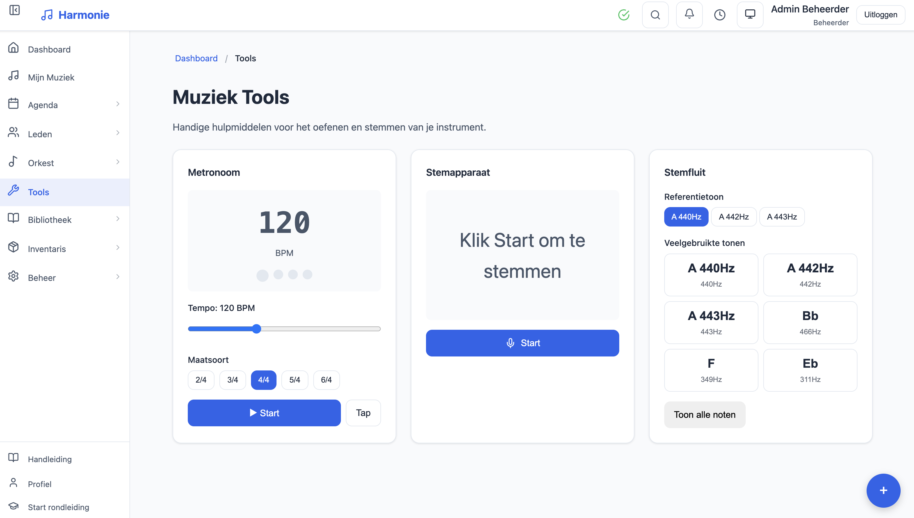
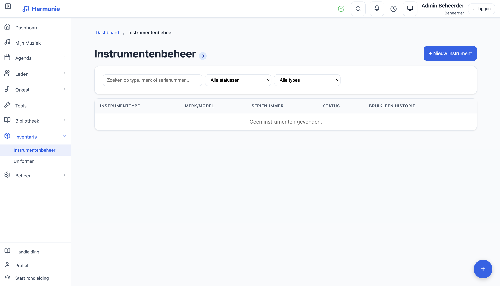

# Tutti Music App

[](https://github.com/ruudsl/tutti/actions/workflows/ci.yml)
[](https://github.com/ruudsl/tutti/actions/workflows/codeql.yml)
[](https://codecov.io/gh/ruudsl/tutti)


_[Nederlandse versie](README.nl.md) · [Deutsche Version](README.de.md)_

A complete web application for managing sheet music, rehearsals, concert programs, and member organization for concert bands and brass bands.

## Overview

Tutti is a multi-tenant web application designed for concert bands, brass bands, and wind orchestras. The application centralizes the management of sheet music (PDFs), rehearsal schedules, concert programs, music material loans, and member management.

### Core Features

- **Music Library** — Upload, categorize, and distribute PDF sheet music to members based on their instruments
- **Rehearsals & Attendance** — Schedule rehearsals, integrate with Spond for automatic attendance tracking
- **Concert Programs** — Create setlists with time calculations and piece numbering
- **Member Management** — Manage members, instruments, orchestras, and roles
- **Tickets & Concerts** — Sell tickets online with QR scanning and seat management
- **Multi-tenant** — Support for multiple organizations on a single installation

See [docs/FEATURES.md](docs/FEATURES.md) for the complete feature list.

## Screenshots

| Dashboard                                    | Tools                                       |
| -------------------------------------------- | ------------------------------------------- |
|  |  |

| Upload                                 | Instrument                                            |
| -------------------------------------- | ----------------------------------------------------- |
|  |  |

## Quick Start

### Requirements

- **Node.js** 24+ (LTS)
- **npm** 9+

### Installation

```bash
# Clone the repository
git clone https://github.com/ruudsl/tutti.git
cd tutti

# Install dependencies
npm install

# Create configuration (see .env.example for all 69 documented variables)
cp backend/.env.example backend/.env

# Start development server
npm run dev
```

The application is now available at:

- **Frontend:** http://localhost:5173
- **Backend API:** http://localhost:3001

### Default Credentials

On first start, an admin account is automatically created:

- **Email:** `admin@harmonie.nl`
- **Password:** Generated and written to `backend/data/admin-password.txt`

The console prints the path, not the password itself. Delete that file once you
have stored the password somewhere safe.

You can preset a password via `ADMIN_INIT_PASSWORD` environment variable; in that
case no file is written.

## Development

```bash
# Start both backend + frontend
npm run dev

# Backend only
npm run dev --workspace=backend

# Frontend only
npm run dev --workspace=frontend

# Run tests
npm test --workspace=backend
npm test --workspace=frontend

# Build for production
npm run build
```

### Filename Format for Music Uploads

```
Title_arranger_instrument_key_groupnumber_clef.pdf
```

Examples:

- `The Pacific_Ted Ricketts_Baritone_Bb__sol.pdf`
- `Shannon Song_Rowwen Heze_Alto Saxophone_Eb_1.pdf`

## Deployment

### Recommended Setup

| Component | Platform                         |
| --------- | -------------------------------- |
| Frontend  | [Vercel](https://vercel.com)     |
| Backend   | [Render.com](https://render.com) |

See [docs/DEPLOYMENT.md](docs/DEPLOYMENT.md) for detailed deployment instructions.

### Docker

```bash
cp .env.example .env
# Edit .env with your settings
docker-compose up -d
```

See [docs/SELF_HOSTING.md](docs/SELF_HOSTING.md) for self-hosting options.

## Documentation

### User Documentation

| Document                                            | Description                        |
| --------------------------------------------------- | ---------------------------------- |
| [USER_GUIDE.md](docs/USER_GUIDE.md)                 | Complete user guide (Dutch)        |
| [FEATURES.md](docs/FEATURES.md)                     | Complete feature list              |
| [KEYBOARD_SHORTCUTS.md](docs/KEYBOARD_SHORTCUTS.md) | Keyboard shortcuts reference       |
| [MOBILE_APP.md](docs/MOBILE_APP.md)                 | Mobile/PWA guide                   |
| [FAQ.md](docs/FAQ.md)                               | Frequently asked questions (Dutch) |
| [TROUBLESHOOTING.md](docs/TROUBLESHOOTING.md)       | Troubleshooting guide (Dutch)      |

### Admin & Operations

| Document                                        | Description                             |
| ----------------------------------------------- | --------------------------------------- |
| [ADMIN.md](docs/ADMIN.md)                       | Administration guide                    |
| [ROLE_PERMISSIONS.md](docs/ROLE_PERMISSIONS.md) | Role-based permissions matrix           |
| [DEPLOYMENT.md](docs/DEPLOYMENT.md)             | Deployment guide (Render/Vercel/Docker) |
| [SELF_HOSTING.md](docs/SELF_HOSTING.md)         | Self-hosting guide                      |
| [MONITORING.md](docs/MONITORING.md)             | Monitoring & observability              |

### Developer Documentation

| Document                                            | Description                   |
| --------------------------------------------------- | ----------------------------- |
| [ARCHITECTURE.md](docs/ARCHITECTURE.md)             | System architecture           |
| [DATABASE.md](docs/DATABASE.md)                     | Database schema & ERD         |
| [POSTGRES_MIGRATION.md](docs/POSTGRES_MIGRATION.md) | PostgreSQL migration path     |
| [API.md](docs/API.md)                               | REST API documentation        |
| [AUTHENTICATION.md](docs/AUTHENTICATION.md)         | Auth flows & JWT/MFA          |
| [WEBSOCKET.md](docs/WEBSOCKET.md)                   | WebSocket events reference    |
| [STATE_MANAGEMENT.md](docs/STATE_MANAGEMENT.md)     | Frontend state patterns       |
| [HOOKS.md](docs/HOOKS.md)                           | React hooks documentation     |
| [TESTING.md](docs/TESTING.md)                       | Testing strategy & guidelines |
| [THEMING.md](docs/THEMING.md)                       | Theming system                |

### Integration & Compliance

| Document                                      | Description                        |
| --------------------------------------------- | ---------------------------------- |
| [INTEGRATIONS.md](docs/INTEGRATIONS.md)       | Third-party integrations           |
| [GDPR.md](docs/GDPR.md)                       | GDPR compliance guide              |
| [EMAIL_TEMPLATES.md](docs/EMAIL_TEMPLATES.md) | Email template reference           |
| [PRINT_TEMPLATES.md](docs/PRINT_TEMPLATES.md) | Print templates (tickets, posters) |

### Architecture Decisions

See [docs/adr/](docs/adr/) for Architecture Decision Records (ADRs).

### API Testing

Import the [Postman collection](docs/postman/tutti-api-collection.json) for interactive API testing.

## Security

See [SECURITY.md](SECURITY.md) for our security policy and how to report vulnerabilities.

## Tech Stack

| Backend         | Frontend           |
| --------------- | ------------------ |
| Node.js 24+     | React 18           |
| Express 4.x     | Vite 5.x           |
| TypeScript 5.x  | TanStack Query 5.x |
| SQLite (sql.js) | React Router 6.x   |
| JWT + TOTP MFA  | i18next (NL/EN/DE) |

See [docs/ARCHITECTURE.md](docs/ARCHITECTURE.md) for the full technology list.

## License

[MIT](LICENSE)
