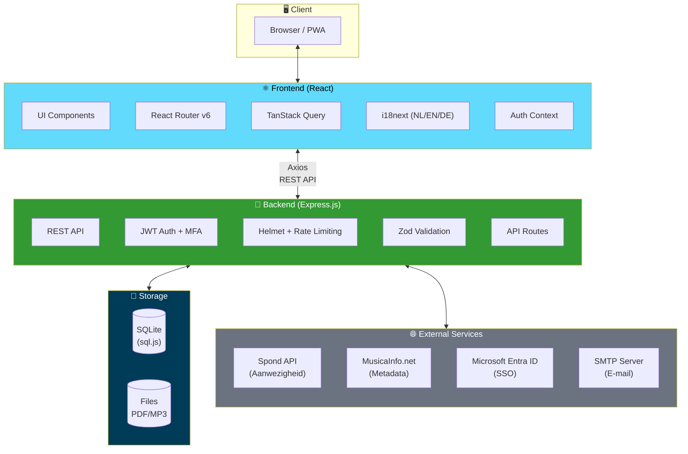

# Tutti Muziek App


Een complete webapplicatie voor het beheren van muziekstukken, repetities, concertprogramma's en ledenorganisatie binnen harmonieorkesten en fanfares.

## Inhoudsopgave

- [Overzicht](#overzicht)
- [Architectuur](#architectuur)
- [Functionaliteiten](#functionaliteiten)
- [Screenshots](#screenshots)
- [Installatie](#installatie)
- [Configuratie](#configuratie)
- [Development](#development)
- [Testen](#testen)
- [Deployment](#deployment)
- [API Documentatie](#api-documentatie)
- [Projectstructuur](#projectstructuur)
- [Technologieën](#technologieën)
- [Licentie](#licentie)

## Overzicht

Tutti is een multi-tenant webapplicatie ontworpen voor harmonieorkesten, fanfares en brassbands. De applicatie centraliseert het beheer van muziekstukken (PDF's), repetitieplanningen, concertprogramma's, leningen van muziekmateriaal en ledenbeheer. Meerdere verenigingen kunnen dezelfde installatie delen en optioneel muziek met elkaar delen.

### Kernfunctionaliteit

- **Muziekbibliotheek** — Upload, categoriseer en distribueer PDF-bladmuziek aan leden op basis van hun instrumenten
- **Repetities & Aanwezigheid** — Plan repetities, koppel met Spond voor automatische aanwezigheidsregistratie
- **Concertprogramma's** — Stel programma's samen met tijdsberekening en stuknummering
- **Ledenbeheer** — Beheer leden, instrumenten, orkesten en rollen
- **Metadata verrijking** — Haal automatisch speelduur en moeilijkheidsgraad op via MusicaInfo.net
- **Multi-tenant** — Ondersteuning voor meerdere verenigingen op één installatie

## Architectuur



### Systeem Componenten

```mermaid
flowchart LR
    subgraph FE["Frontend Modules"]
        Pages["📄 50 Pages"]
        Components["🧩 60 Components"]
        Hooks["🪝 32 Custom Hooks"]
        Utils["🔧 Utilities"]
    end

    subgraph BE["Backend Modules"]
        AuthRoutes["🔐 Auth Routes"]
        MusicRoutes["🎵 Music Routes"]
        UserRoutes["👥 User Routes"]
        AdminRoutes["⚙️ Admin Routes"]
    end

    subgraph DB["Database (87 Tabellen)"]
        Users["users"]
        Music["music_pieces"]
        Lists["music_lists"]
        Orchestras["orchestras"]
        Rehearsals["rehearsals"]
        AuditLogs["audit_logs"]
    end

    FE --> BE
    BE --> DB
```



### Text-diagram (fallback)

```
┌─────────────────────────────────┐
│         Frontend (React)        │
│  Vite · TypeScript · TanStack   │
│  i18n (NL/EN/DE) · React Router │
└──────────────┬──────────────────┘
               │ REST API (Axios)
               ▼
┌─────────────────────────────────┐
│       Backend (Express.js)      │
│  TypeScript · JWT Auth · Helmet │
│  Rate Limiting · Zod Validation │
└──────────────┬──────────────────┘
               │
       ┌───────┴───────┐
       ▼               ▼
┌─────────────┐  ┌───────────┐
│   SQLite    │  │   Files   │
│  (sql.js)   │  │  PDF/MP3  │
└─────────────┘  └───────────┘
       │
       ▼
┌─────────────────────────────────┐
│      External Services          │
│  Spond · MusicaInfo · Entra ID  │
└─────────────────────────────────┘
```

### Design beslissingen

| Beslissing | Motivatie |
|---|---|
| **SQLite i.p.v. PostgreSQL** | Geen aparte database-server nodig; eenvoudige backup (één bestand); voldoende voor de typische schaal van een vereniging |
| **sql.js i.p.v. better-sqlite3** | Geen native compilatie vereist; draait op elk platform zonder build-tools |
| **Multi-tenant via association_id** | Elke vereniging heeft eigen data, instrumenten en instellingen; optioneel muziek delen |
| **JWT authenticatie** | Stateless, schaalbaar; optioneel uitbreidbaar met TOTP MFA en Microsoft SSO |
| **i18n met i18next** | Meertalige ondersteuning (Nederlands, Engels, Duits) voor internationaal gebruik |

### Rollenmodel

| Rol | Rechten |
|---|---|
| `member` | Eigen muziekstukken bekijken en downloaden, profiel beheren |
| `conductor` | Alles van member + repetities en concertprogramma's beheren |
| `music_committee` | Alles van conductor + muziekstukken uploaden, instrumenten beheren, issues behandelen |
| `admin` | Volledige toegang: ledenbeheer, instellingen, backup/restore, verenigingsconfiguratie |

## Functionaliteiten

### Muziekbeheer

- **Upload** — Sleep PDF's naar de dropzone; metadata wordt automatisch geparseerd uit de bestandsnaam (`Titel_arrangeur_instrument_stemming_groepnummer_sleutel.pdf`)
- **Muziekstukken** — Bladmuziek per instrument met filters op titel, instrument en orkest
- **Muziektitels** — Metadata per titel: componist, arrangeur, genre, speelduur, moeilijkheidsgraad, YouTube-link
- **MusicaInfo.net integratie** — Zoek en importeer metadata (speelduur, moeilijkheidsgraad, uitgever) automatisch
- **Instrumentaliassen** — Flexibel instrument-matching (bijv. "Altsax" → "Alto Saxophone Eb")
- **Delen** — Deel muziekstukken en titels tussen verenigingen
- **MP3 uploads** — Voeg audio-opnames toe aan muziekstukken
- **PDF Tools** — Samenvoegen, pagina's extraheren en transponeren van PDF's

### Repetities & Aanwezigheid

- **Standaard repetitiedagen** — Stel terugkerende dagen/tijden in per orkest
- **Repetitie-instanties** — Automatisch gegenereerd of handmatig aangemaakt (regulier/extra/geannuleerd)
- **Spond koppeling** — Synchroniseer aanwezigheidsdata automatisch vanuit Spond
- **Aanwezigheidsoverzicht** — Per lid: aantal keer aanwezig, afwezig, percentage (filterbaar op datum en orkest)

### Concertprogramma's & Muzieklijsten

- **Setlists** — Stel concertprogramma's samen per orkest met datum, locatie en opmerkingen
- **Tijdsberekening** — Automatische berekening van totale speelduur
- **Muziekcommissie notities** — Interne opmerkingen bij titels (alleen zichtbaar voor commissieleden)

### Ledenbeheer

- **Gebruikers** — Aanmaken, bewerken, verwijderen met paginering en zoekfunctie
- **Instrumenten** — Toewijzen aan leden met stemming en muzieksleutel
- **Orkesten** — Leden koppelen aan meerdere orkesten
- **Rollen** — Flexibel rollensysteem (member, conductor, music_committee, admin)

### Uitleenbeheer

- **Leningen** — Registreer uitleningen van muziekmateriaal aan externe organisaties
- **Status tracking** — Actief, te laat, geretourneerd met automatische statusupdates
- **Beschikbaarheid** — Overzicht welke titels beschikbaar zijn voor uitlening

### Issues & Kwaliteitsbeheer

- **Meldingen** — Leden kunnen fouten in bladmuziek melden (verkeerde noten, ontbrekende pagina's)
- **Workflow** — Status tracking: open → in review → opgelost/afgewezen

### Beveiliging & Authenticatie

- **JWT tokens** — Veilige authenticatie met configureerbare geldigheidsduur
- **TOTP MFA** — Optionele tweefactor-authenticatie via authenticator-app
- **Microsoft SSO** — Azure Entra ID (voorheen Azure AD) integratie
- **Wachtwoord reset** — Via e-mail met beveiligde tokens
- **Rate limiting** — Bescherming tegen brute-force aanvallen
- **Helmet** — HTTP security headers

### Overige features

- **Thema's** — Aanpasbare kleuren en branding per vereniging
- **Logo** — Upload verenigingslogo
- **SMTP configuratie** — E-mail instellingen per vereniging
- **Backup & Restore** — Download/upload volledige database met bestanden als ZIP
- **Activiteitenlog** — Track wie wat bekijkt en downloadt
- **Statistieken** — Dashboard met top-bekeken en -gedownloade stukken
- **Changelog** — In-app versiegeschiedenis
- **Onboarding tour** — Begeleide rondleiding voor nieuwe gebruikers
- **Muziektools** — Ingebouwde metronoom en stemapparaat
- **WCAG 2.1 AA** — Toegankelijke interface met toetsenbordnavigatie en contrastverhouding

## Screenshots

| Dashboard | Muziekstukken |
|---|---|
|  |  |

| Upload | Muzieklijsten |
|---|---|
|  |  |

## Installatie

### Vereisten

- **Node.js** 18+ (20+ aanbevolen)
- **npm** 9+
- **Git**

### Snelle start

```bash
# 1. Clone de repository
git clone https://github.com/ruudsl/tutti.git
cd tutti

# 2. Installeer alle dependencies (backend + frontend)
npm install

# 3. Maak configuratiebestanden aan
cp backend/.env.example backend/.env
cp frontend/.env.example frontend/.env.local

# 4. Pas de backend configuratie aan (zie Configuratie hieronder)
#    Minimaal: stel een JWT_SECRET in voor productie

# 5. Start de ontwikkelserver (backend + frontend tegelijk)
npm run dev
```

De applicatie is nu beschikbaar op:
- **Frontend:** http://localhost:5173
- **Backend API:** http://localhost:3001

### Standaard inloggegevens

Bij de eerste start wordt automatisch een admin-account aangemaakt:
- **E-mail:** `admin@tutti.nl`
- **Wachtwoord:** wordt gegenereerd en getoond in de console-output

Je kunt ook vooraf een wachtwoord instellen via de environment variable `ADMIN_INIT_PASSWORD`.

> **Let op:** Wijzig het wachtwoord na de eerste login via Profiel → Wachtwoord wijzigen!

## Configuratie

### Backend (`backend/.env`)

| Variable | Standaard | Beschrijving |
|---|---|---|
| `NODE_ENV` | `development` | `development` of `production` |
| `PORT` | `3001` | Poort voor de API server |
| `JWT_SECRET` | *(dev-only default)* | **Verplicht in productie!** Genereer met `openssl rand -hex 32` |
| `JWT_EXPIRES_IN` | `7d` | Geldigheidsduur JWT tokens (bijv. `1d`, `12h`) |
| `DB_PATH` | `./data/tutti.db` | Pad naar SQLite database bestand |
| `UPLOAD_DIR` | `./uploads` | Map voor geüploade PDF bestanden |
| `MP3_UPLOAD_DIR` | `./uploads/mp3` | Map voor geüploade MP3 bestanden |
| `MAX_FILE_SIZE` | `52428800` | Max bestandsgrootte in bytes (standaard 50MB) |
| `FRONTEND_URL` | `http://localhost:5173` | Frontend URL voor CORS-configuratie |
| `ADMIN_INIT_PASSWORD` | *(leeg)* | Optioneel: admin wachtwoord bij eerste start |
| `RATE_LIMIT_WINDOW_MS` | `900000` | Rate limit venster in ms (standaard 15 min) |
| `RATE_LIMIT_MAX_REQUESTS` | `100` | Max requests per venster |
| `AUTH_RATE_LIMIT_MAX_REQUESTS` | `5` | Max login pogingen per venster |

### Frontend (`frontend/.env.local`)

| Variable | Standaard | Beschrijving |
|---|---|---|
| `VITE_API_URL` | *(leeg = proxy)* | Backend API URL. Leeg laten voor development (Vite proxy). In productie: volledige URL bijv. `https://api.example.com/api` |

## Development

### Commando's

```bash
# Start backend + frontend tegelijkertijd
npm run dev

# Alleen backend
npm run dev --workspace=backend

# Alleen frontend
npm run dev --workspace=frontend

# Build voor productie
npm run build

# Database opnieuw initialiseren (waarschuwing: wist alle data)
npm run db:init --workspace=backend
```

### Bestandsnaam formaat

Muziekstukken worden automatisch geparseerd op basis van de bestandsnaam:

```
Titel_arrangeur_instrument_stemming_groepnummer_muzieksleutel.pdf
```

Voorbeelden:
- `The Pacific_Ted Ricketts_Bariton_Bb__sol.pdf`
- `Shannon Song_Rowwen Heze_Alto Saxophone_Eb_1.pdf`
- `Shannon Song_Rowwen Heze_Altsax_Eb_2.pdf` (alias wordt herkend)

## Testen

### Frontend testen

```bash
# Run alle frontend tests
npm test --workspace=frontend

# Watch mode (automatisch herladen bij wijzigingen)
npm run test:watch --workspace=frontend
```

### Backend testen

```bash
# Run alle backend tests
npm test --workspace=backend

# Watch mode
npm run test:watch --workspace=backend
```

### Alle testen

```bash
# CI-stijl: TypeScript check + tests + build
npm test --workspace=frontend && npm test --workspace=backend
```

## Deployment

### Backend deployen op Render.com

1. **Maak een account** op [render.com](https://render.com) en log in

2. **Klik op "New" → "Web Service"**

3. **Connect je GitHub repository** en selecteer de tutti repository

4. **Configureer de service:**
   - **Name:** `tutti-backend`
   - **Region:** Frankfurt (EU Central)
   - **Root Directory:** `backend`
   - **Runtime:** Node
   - **Build Command:** `npm install && npm run build`
   - **Start Command:** `npm start`

5. **Voeg Environment Variables toe:**

   | Key | Value |
   |---|---|
   | `NODE_ENV` | `production` |
   | `PORT` | `10000` |
   | `JWT_SECRET` | *(genereer met `openssl rand -hex 32`)* |
   | `DB_PATH` | `/opt/render/project/data/tutti.db` |
   | `UPLOAD_DIR` | `/opt/render/project/data/uploads` |
   | `MP3_UPLOAD_DIR` | `/opt/render/project/data/uploads/mp3` |
   | `FRONTEND_URL` | *(vul later in na frontend deployment)* |

6. **Voeg een Disk toe** voor persistente opslag:
   - **Mount Path:** `/opt/render/project/data`
   - **Size:** 1 GB (of meer indien nodig)

7. **Klik op "Create Web Service"** en noteer de URL

### Frontend deployen op Vercel

1. **Maak een account** op [vercel.com](https://vercel.com) en log in

2. **Import je GitHub repository** via "Add New..." → "Project"

3. **Configuratie:**
   - **Framework Preset:** Vite
   - **Root Directory:** `frontend`

4. **Environment Variable:**

   | Key | Value |
   |---|---|
   | `VITE_API_URL` | Backend URL + `/api`, bijv. `https://tutti-backend.onrender.com/api` |

5. **Deploy** en noteer de frontend URL

### Na beide deployments

Ga terug naar Render.com en stel `FRONTEND_URL` in op de Vercel URL voor CORS.

### Troubleshooting

| Probleem | Oplossing |
|---|---|
| "Cannot GET /api" | Check of `VITE_API_URL` correct is (moet eindigen op `/api`) |
| CORS errors bij login | Stel `FRONTEND_URL` correct in op Render (exact, met https://, zonder trailing slash) |
| Backend start niet | Check de Render logs; verifieer alle environment variables |
| Data kwijt na redeploy | Voeg een Disk toe met het juiste mount path |

## API Documentatie

### Authenticatie

Alle endpoints (behalve login) vereisen een JWT token in de `Authorization` header:

```
Authorization: Bearer <token>
```

### Endpoints overzicht

| Groep | Pad | Beschrijving |
|---|---|---|
| Auth | `/api/auth/*` | Login, profiel, wachtwoord, MFA, wachtwoord-reset |
| Gebruikers | `/api/users/*` | CRUD leden, instrumenten/orkesten toewijzen |
| Instrumenten | `/api/instruments/*` | CRUD instrumenten en aliassen |
| Orkesten | `/api/orchestras/*` | CRUD orkesten, ledenbeheer |
| Muziekstukken | `/api/music-pieces/*` | Upload, download, metadata, MP3, delen |
| Muziektitels | `/api/music-titles/*` | Metadata bibliotheek (via music-pieces routes) |
| Muzieklijsten | `/api/music-lists/*` | Setlists en concertprogramma's |
| Genres | `/api/genres/*` | Muziekgenres/categorieën |
| Repetities | `/api/rehearsals/*` | Planning, standaarddagen, aanwezigheid |
| Spond | `/api/spond/*` | Spond configuratie en synchronisatie |
| Leningen | `/api/loans/*` | Uitleenbeheer |
| Issues | `/api/issues/*` | Meldingen bladmuziekfouten |
| Activiteit | `/api/activity/*` | Logging en statistieken |
| MusicaInfo | `/api/musicainfo/*` | Metadata opzoeken via MusicaInfo.net |
| PDF Tools | `/api/pdf-tools/*` | PDF samenvoegen, extraheren, transponeren |
| Instellingen | `/api/settings/*` | Verenigingsinstellingen, thema, SMTP |
| Backup | `/api/backup/*` | Database backup en restore |
| Microsoft | `/api/microsoft-auth/*` | Azure Entra SSO |

## Projectstructuur

```
tutti/
├── backend/
│   ├── src/
│   │   ├── config.ts              # Configuratie en environment variables
│   │   ├── index.ts               # Express server entry point
│   │   ├── database/
│   │   │   ├── connection.ts      # SQLite connectie (sql.js wrapper)
│   │   │   ├── schema.ts          # Database schema (87 tabellen)
│   │   │   └── init.ts            # Initialisatie script
│   │   ├── middleware/
│   │   │   ├── auth.ts            # JWT authenticatie & autorisatie
│   │   │   └── errorHandler.ts    # Centrale error handling
│   │   ├── routes/                # 51 API route modules
│   │   │   ├── auth.ts            # Login, MFA, wachtwoord-reset
│   │   │   ├── users.ts           # Ledenbeheer
│   │   │   ├── instruments.ts     # Instrumenten & aliassen
│   │   │   ├── orchestras.ts      # Orkesten
│   │   │   ├── music-pieces.ts    # Muziekstukken (PDF)
│   │   │   ├── music-lists.ts     # Concertprogramma's
│   │   │   ├── rehearsals.ts      # Repetities & aanwezigheid
│   │   │   ├── spond.ts           # Spond integratie
│   │   │   ├── loans.ts           # Uitleenbeheer
│   │   │   ├── issues.ts          # Meldingen
│   │   │   ├── musicainfo.ts      # MusicaInfo.net scraper
│   │   │   ├── pdf-tools.ts       # PDF manipulatie
│   │   │   ├── settings.ts        # Verenigingsinstellingen
│   │   │   ├── backup.ts          # Backup & restore
│   │   │   ├── activity.ts        # Activiteitenlog
│   │   │   ├── genres.ts          # Genres
│   │   │   ├── associations.ts    # Multi-tenant beheer
│   │   │   └── microsoft-auth.ts  # Azure SSO
│   │   ├── services/
│   │   │   └── spond.ts           # Spond API client
│   │   └── utils/
│   │       ├── database.ts        # Transacties & paginering helpers
│   │       ├── email.ts           # SMTP e-mail verzending
│   │       └── logger.ts          # Winston logging
│   ├── data/                      # SQLite database (gegenereerd)
│   ├── uploads/                   # Geüploade PDF/MP3 bestanden
│   └── package.json
├── frontend/
│   ├── src/
│   │   ├── api.ts                 # Axios API client met alle endpoints
│   │   ├── types.ts               # TypeScript type definities
│   │   ├── App.tsx                # Root component met routing
│   │   ├── pages/                 # 50 pagina-componenten
│   │   ├── components/            # 60 herbruikbare componenten
│   │   ├── hooks/                 # 32 custom React hooks
│   │   ├── context/               # Auth context (login state)
│   │   ├── lib/                   # React Query configuratie
│   │   ├── utils/                 # Utility functies met tests
│   │   ├── locales/               # i18n vertalingen (NL, EN, DE)
│   │   └── test/                  # Test setup
│   └── package.json
├── .github/workflows/ci.yml      # GitHub Actions CI/CD
├── LICENSE                        # MIT licentie
└── package.json                   # Workspace root (npm workspaces)
```

## Technologieën

### Backend

| Technologie | Versie | Doel |
|---|---|---|
| Node.js | 20+ | Runtime |
| Express | 4.x | HTTP framework |
| TypeScript | 5.x | Type safety |
| sql.js | 1.x | SQLite database (WASM) |
| JWT (jsonwebtoken) | 9.x | Authenticatie |
| Zod | 4.x | Request validatie |
| Cheerio | 1.x | HTML parsing (MusicaInfo scraper) |
| Winston | 3.x | Logging |
| Helmet | 8.x | HTTP security headers |
| Multer | 1.x | File uploads |
| pdf-lib | 1.x | PDF manipulatie |
| Nodemailer | 7.x | E-mail verzending |
| otplib | 13.x | TOTP MFA |
| Vitest | 3.x | Unit & integratie tests |

### Frontend

| Technologie | Versie | Doel |
|---|---|---|
| React | 18.x | UI framework |
| TypeScript | 5.x | Type safety |
| Vite | 5.x | Build tool & dev server |
| React Router | 6.x | Client-side routing |
| TanStack Query | 5.x | Server state management |
| Axios | 1.x | HTTP client |
| i18next | 25.x | Internationalisatie (NL/EN/DE) |
| React Hook Form | 7.x | Formulierbeheer |
| Zod | 4.x | Formuliervalidatie |
| pdfjs-dist | 4.x | PDF preview rendering |
| Vitest | 4.x | Unit tests |
| Testing Library | 16.x | Component tests |

## Licentie

[MIT](LICENSE)
