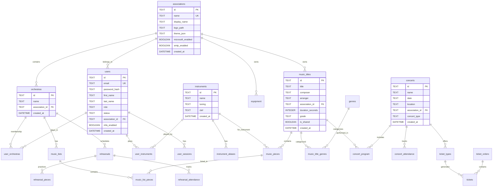

# Database Documentation

## Overview

Harmonie uses **SQLite** as its database engine, chosen for its simplicity, portability, and excellent performance for single-server deployments typical of music association management applications.

**Database file location:** `backend/data/harmonie.db`

**Schema management:** Migrations are located in `/backend/src/migrations/` and run automatically on application startup.

---

## Entity Relationship Overview

The database is organized into several domains:

```
┌─────────────────────────────────────────────────────────────────────────────┐
│                              CORE DOMAIN                                     │
│  associations ──< orchestras ──< users ──< user_instruments >── instruments │
│       │              │           │                                           │
│       │              └───────────┴──< user_orchestras                        │
└─────────────────────────────────────────────────────────────────────────────┘
                                    │
        ┌───────────────────────────┼───────────────────────────┐
        ▼                           ▼                           ▼
┌───────────────┐         ┌─────────────────┐         ┌─────────────────┐
│ MUSIC LIBRARY │         │     EVENTS      │         │   TICKETING     │
│ music_titles  │         │   rehearsals    │         │  ticket_orders  │
│ music_pieces  │         │    concerts     │         │    tickets      │
│ music_lists   │         │     events      │         │ ticket_invoices │
│    genres     │         │  event_attend.  │         │ discount_codes  │
└───────────────┘         └─────────────────┘         └─────────────────┘
        │                           │                           │
        ▼                           ▼                           ▼
┌───────────────┐         ┌─────────────────┐         ┌─────────────────┐
│ COMMUNICATION │         │   EQUIPMENT     │         │     SYSTEM      │
│     posts     │         │   equipment     │         │   audit_logs    │
│     polls     │         │ uniform_items   │         │ user_sessions   │
│ notifications │         │ instrument_loan │         │  ip_whitelist   │
│ section_chat  │         │ instrument_asset│         │ payment_setting │
└───────────────┘         └─────────────────┘         └─────────────────┘
```

---

## Mermaid ERD Diagram (Core Entities)



---

## Tables by Domain

### Core Domain

#### associations

Parent organizations that own orchestras, users, and all other data.

| Column                  | Type     | Description                                |
| ----------------------- | -------- | ------------------------------------------ |
| id                      | TEXT     | Primary key (UUID)                         |
| name                    | TEXT     | Unique identifier name                     |
| display_name            | TEXT     | Human-readable display name                |
| logo_path               | TEXT     | Path to logo image                         |
| theme_json              | TEXT     | JSON theme configuration                   |
| microsoft_client_id     | TEXT     | Microsoft Entra ID client ID               |
| microsoft_client_secret | TEXT     | Microsoft Entra ID client secret           |
| microsoft_tenant_id     | TEXT     | Microsoft Entra tenant ID                  |
| microsoft_enabled       | BOOLEAN  | SSO enabled flag                           |
| smtp_host               | TEXT     | Email server host                          |
| smtp_port               | INTEGER  | Email server port (default: 587)           |
| smtp_secure             | BOOLEAN  | Use TLS                                    |
| smtp_user               | TEXT     | SMTP username                              |
| smtp_pass               | TEXT     | SMTP password                              |
| smtp_from               | TEXT     | From email address                         |
| smtp_enabled            | BOOLEAN  | Email sending enabled                      |
| google_drive_client_id  | TEXT     | Google Drive client ID                     |
| google_drive_api_key    | TEXT     | Google Drive API key                       |
| google_drive_enabled    | BOOLEAN  | Google Drive integration enabled           |
| parent_id               | TEXT     | FK to parent association (for hierarchies) |
| subscription_tier       | TEXT     | Subscription level (free, basic, premium)  |
| subscription_expires    | DATETIME | Subscription expiration date               |
| max_members             | INTEGER  | Maximum allowed members                    |
| max_orchestras          | INTEGER  | Maximum allowed orchestras                 |
| max_storage_mb          | INTEGER  | Maximum storage in MB                      |
| is_active               | BOOLEAN  | Association is active                      |
| slug                    | TEXT     | URL-friendly identifier                    |
| website                 | TEXT     | Association website                        |
| phone                   | TEXT     | Contact phone                              |
| email                   | TEXT     | Contact email                              |
| address                 | TEXT     | Street address                             |
| city                    | TEXT     | City                                       |
| postal_code             | TEXT     | Postal code                                |
| country                 | TEXT     | Country (default: Nederland)               |
| billing_email           | TEXT     | Billing contact email                      |
| kvk_number              | TEXT     | Chamber of Commerce number                 |
| iban                    | TEXT     | Bank account IBAN                          |
| created_at              | DATETIME | Creation timestamp                         |

**Indexes:** `idx_associations_slug` (unique)

---

#### orchestras

Music ensembles within an association.

| Column         | Type     | Description        |
| -------------- | -------- | ------------------ |
| id             | TEXT     | Primary key (UUID) |
| name           | TEXT     | Orchestra name     |
| association_id | TEXT     | FK to associations |
| created_at     | DATETIME | Creation timestamp |

**Foreign Keys:**

- `association_id` -> `associations(id)` ON DELETE CASCADE

**Indexes:** `idx_orchestras_association`

---

#### users

Members and administrators of the system.

| Column             | Type     | Description                                                                                              |
| ------------------ | -------- | -------------------------------------------------------------------------------------------------------- |
| id                 | TEXT     | Primary key (UUID)                                                                                       |
| email              | TEXT     | Unique email address                                                                                     |
| password_hash      | TEXT     | Bcrypt password hash                                                                                     |
| first_name         | TEXT     | First name                                                                                               |
| last_name          | TEXT     | Last name                                                                                                |
| role               | TEXT     | Role: admin, music_committee, equipment_committee, uniforms_committee, conductor, section_leader, member |
| status             | TEXT     | Status: active, inactive, pending                                                                        |
| association_id     | TEXT     | FK to associations                                                                                       |
| mfa_secret         | TEXT     | TOTP secret for MFA                                                                                      |
| mfa_enabled        | BOOLEAN  | MFA enabled flag                                                                                         |
| microsoft_id       | TEXT     | Microsoft Entra Object ID                                                                                |
| profile_photo_path | TEXT     | Path to profile photo                                                                                    |
| private_email      | TEXT     | Private email (for forwarding)                                                                           |
| last_login         | DATETIME | Last login timestamp                                                                                     |
| onboarded_at       | DATETIME | Onboarding completion date                                                                               |
| offboarded_at      | DATETIME | Offboarding date                                                                                         |
| deleted_at         | DATETIME | Soft delete timestamp                                                                                    |
| created_at         | DATETIME | Creation timestamp                                                                                       |

**Foreign Keys:**

- `association_id` -> `associations(id)` ON DELETE SET NULL

**Indexes:** `idx_users_email`, `idx_users_association`, `idx_users_deleted_at`

---

#### instruments

Musical instruments with tuning and clef information.

| Column     | Type     | Description              |
| ---------- | -------- | ------------------------ |
| id         | TEXT     | Primary key (UUID)       |
| name       | TEXT     | Instrument name          |
| tuning     | TEXT     | Tuning (Bb, Eb, C, etc.) |
| clef       | TEXT     | Music clef: sol, fa, ut  |
| created_at | DATETIME | Creation timestamp       |

**Unique Constraint:** `(name, tuning, clef)`

---

#### instrument_aliases

Alternative names for instruments.

| Column        | Type     | Description        |
| ------------- | -------- | ------------------ |
| id            | TEXT     | Primary key (UUID) |
| instrument_id | TEXT     | FK to instruments  |
| alias         | TEXT     | Alternative name   |
| created_at    | DATETIME | Creation timestamp |

**Foreign Keys:**

- `instrument_id` -> `instruments(id)` ON DELETE CASCADE

**Unique Constraint:** `(instrument_id, alias)`

**Indexes:** `idx_instrument_aliases_alias`

---

#### user_instruments

Junction table: users play instruments.

| Column        | Type | Description            |
| ------------- | ---- | ---------------------- |
| user_id       | TEXT | FK to users (PK)       |
| instrument_id | TEXT | FK to instruments (PK) |

**Primary Key:** `(user_id, instrument_id)`

**Foreign Keys:**

- `user_id` -> `users(id)` ON DELETE CASCADE
- `instrument_id` -> `instruments(id)` ON DELETE CASCADE

---

#### user_orchestras

Junction table: users belong to orchestras.

| Column       | Type | Description           |
| ------------ | ---- | --------------------- |
| user_id      | TEXT | FK to users (PK)      |
| orchestra_id | TEXT | FK to orchestras (PK) |

**Primary Key:** `(user_id, orchestra_id)`

**Foreign Keys:**

- `user_id` -> `users(id)` ON DELETE CASCADE
- `orchestra_id` -> `orchestras(id)` ON DELETE CASCADE

---

### Music Library Domain

#### music_titles

Metadata for music compositions.

| Column            | Type     | Description                     |
| ----------------- | -------- | ------------------------------- |
| id                | TEXT     | Primary key (UUID)              |
| title             | TEXT     | Composition title               |
| composer          | TEXT     | Original composer               |
| arranger          | TEXT     | Arranger name                   |
| youtube_url       | TEXT     | YouTube reference               |
| description       | TEXT     | Description text                |
| duration_seconds  | INTEGER  | Duration in seconds             |
| grade             | TEXT     | Difficulty grade (1-5)          |
| mp3_file_path     | TEXT     | Path to MP3 preview             |
| is_shared         | BOOLEAN  | Shared with other associations  |
| internal_notes    | TEXT     | Committee-only notes            |
| streaming_links   | TEXT     | JSON: Spotify, Apple Music URLs |
| imslp_work_id     | TEXT     | IMSLP work ID                   |
| imslp_permalink   | TEXT     | IMSLP permanent link            |
| performance_count | INTEGER  | Cached performance count        |
| last_performed    | TEXT     | Last performance date           |
| association_id    | TEXT     | FK to associations              |
| deleted_at        | DATETIME | Soft delete timestamp           |
| created_at        | DATETIME | Creation timestamp              |

**Foreign Keys:**

- `association_id` -> `associations(id)` ON DELETE CASCADE

**Unique Constraint:** `(title, arranger, association_id)`

**Indexes:** `idx_music_titles_title`, `idx_music_titles_association`, `idx_music_titles_performance_count`, `idx_music_titles_last_performed`, `idx_music_titles_deleted_at`

---

#### music_pieces

Individual sheet music files (parts).

| Column            | Type     | Description              |
| ----------------- | -------- | ------------------------ |
| id                | TEXT     | Primary key (UUID)       |
| title             | TEXT     | Part title               |
| arranger          | TEXT     | Arranger                 |
| instrument_id     | TEXT     | FK to instruments        |
| tuning            | TEXT     | Instrument tuning        |
| group_number      | TEXT     | Part number (1st, 2nd)   |
| clef              | TEXT     | Music clef               |
| file_path         | TEXT     | Path to PDF file         |
| original_filename | TEXT     | Original upload filename |
| youtube_url       | TEXT     | YouTube reference        |
| association_id    | TEXT     | FK to associations       |
| is_shared         | BOOLEAN  | Shared flag              |
| uploaded_by       | TEXT     | FK to users              |
| imslp_source      | TEXT     | IMSLP source URL         |
| version           | INTEGER  | Version number           |
| last_modified_by  | TEXT     | Last editor              |
| deleted_at        | DATETIME | Soft delete timestamp    |
| created_at        | DATETIME | Creation timestamp       |

**Foreign Keys:**

- `instrument_id` -> `instruments(id)` ON DELETE SET NULL
- `association_id` -> `associations(id)` ON DELETE CASCADE
- `uploaded_by` -> `users(id)` ON DELETE SET NULL

**Indexes:** `idx_music_pieces_instrument`, `idx_music_pieces_association`, `idx_music_pieces_title`, `idx_music_pieces_assoc_title`, `idx_music_pieces_deleted_at`

---

#### genres

Music genres/categories.

| Column     | Type     | Description        |
| ---------- | -------- | ------------------ |
| id         | TEXT     | Primary key (UUID) |
| name       | TEXT     | Unique genre name  |
| created_at | DATETIME | Creation timestamp |

**Unique Constraint:** `name`

**Indexes:** `idx_genres_name`

---

#### music_lists

Playlists/setlists per orchestra.

| Column           | Type     | Description             |
| ---------------- | -------- | ----------------------- |
| id               | TEXT     | Primary key (UUID)      |
| name             | TEXT     | List name               |
| orchestra_id     | TEXT     | FK to orchestras        |
| position         | INTEGER  | Display order           |
| is_active        | BOOLEAN  | Visible to members      |
| list_type        | TEXT     | regular or concert      |
| concert_date     | TEXT     | Concert date (ISO 8601) |
| concert_location | TEXT     | Concert venue           |
| deleted_at       | DATETIME | Soft delete timestamp   |
| created_at       | DATETIME | Creation timestamp      |

**Foreign Keys:**

- `orchestra_id` -> `orchestras(id)` ON DELETE CASCADE

**Indexes:** `idx_music_lists_deleted_at`

---

#### music_list_pieces

Junction: pieces in lists.

| Column         | Type     | Description             |
| -------------- | -------- | ----------------------- |
| music_list_id  | TEXT     | FK to music_lists (PK)  |
| music_piece_id | TEXT     | FK to music_pieces (PK) |
| position       | INTEGER  | Order in list           |
| added_at       | DATETIME | When added              |

**Primary Key:** `(music_list_id, music_piece_id)`

**Foreign Keys:**

- `music_list_id` -> `music_lists(id)` ON DELETE CASCADE
- `music_piece_id` -> `music_pieces(id)` ON DELETE CASCADE

---

#### music_title_genres

Junction: titles have genres.

| Column         | Type | Description             |
| -------------- | ---- | ----------------------- |
| music_title_id | TEXT | FK to music_titles (PK) |
| genre_id       | TEXT | FK to genres (PK)       |

**Primary Key:** `(music_title_id, genre_id)`

**Foreign Keys:**

- `music_title_id` -> `music_titles(id)` ON DELETE CASCADE
- `genre_id` -> `genres(id)` ON DELETE CASCADE

---

#### loans

Music title lending system.

| Column                | Type     | Description               |
| --------------------- | -------- | ------------------------- |
| id                    | TEXT     | Primary key (UUID)        |
| music_title_id        | TEXT     | FK to music_titles        |
| borrower_name         | TEXT     | Borrower's name           |
| borrower_email        | TEXT     | Borrower's email          |
| borrower_organization | TEXT     | Borrower's organization   |
| notes                 | TEXT     | Loan notes                |
| date_out              | DATETIME | Loan start date           |
| expected_return       | DATETIME | Expected return date      |
| date_returned         | DATETIME | Actual return date        |
| status                | TEXT     | active, returned, overdue |
| created_by            | TEXT     | FK to users               |
| created_at            | DATETIME | Creation timestamp        |

**Foreign Keys:**

- `music_title_id` -> `music_titles(id)` ON DELETE CASCADE
- `created_by` -> `users(id)` ON DELETE CASCADE

**Indexes:** `idx_loans_title`, `idx_loans_status`, `idx_loans_created_by`, `idx_loans_expected_return`, `idx_loans_date_out`

---

### Events Domain

#### rehearsals

Individual rehearsal sessions.

| Column         | Type     | Description                   |
| -------------- | -------- | ----------------------------- |
| id             | TEXT     | Primary key (UUID)            |
| association_id | TEXT     | FK to associations            |
| orchestra_id   | TEXT     | FK to orchestras (NULL = all) |
| date           | TEXT     | Date (YYYY-MM-DD)             |
| start_time     | TEXT     | Start time (HH:MM)            |
| end_time       | TEXT     | End time (HH:MM)              |
| location       | TEXT     | Venue                         |
| type           | TEXT     | regular, extra, cancelled     |
| notes          | TEXT     | Notes                         |
| spond_event_id | TEXT     | Spond integration ID          |
| series_id      | TEXT     | Recurring series ID           |
| created_by     | TEXT     | FK to users                   |
| created_at     | DATETIME | Creation timestamp            |

**Foreign Keys:**

- `association_id` -> `associations(id)` ON DELETE CASCADE
- `orchestra_id` -> `orchestras(id)` ON DELETE SET NULL
- `created_by` -> `users(id)` ON DELETE SET NULL

**Indexes:** `idx_rehearsals_association`, `idx_rehearsals_date`, `idx_rehearsals_series_id`

---

#### rehearsal_default_days

Weekly recurring rehearsal schedule.

| Column         | Type     | Description          |
| -------------- | -------- | -------------------- |
| id             | TEXT     | Primary key (UUID)   |
| association_id | TEXT     | FK to associations   |
| orchestra_id   | TEXT     | FK to orchestras     |
| day_of_week    | INTEGER  | 0=Sunday, 6=Saturday |
| start_time     | TEXT     | Start time (HH:MM)   |
| end_time       | TEXT     | End time (HH:MM)     |
| location       | TEXT     | Default venue        |
| created_at     | DATETIME | Creation timestamp   |

**Foreign Keys:**

- `association_id` -> `associations(id)` ON DELETE CASCADE
- `orchestra_id` -> `orchestras(id)` ON DELETE SET NULL

---

#### rehearsal_pieces

Pieces practiced during rehearsal.

| Column       | Type    | Description        |
| ------------ | ------- | ------------------ |
| id           | TEXT    | Primary key (UUID) |
| rehearsal_id | TEXT    | FK to rehearsals   |
| title        | TEXT    | Piece title        |
| notes        | TEXT    | Conductor notes    |
| sort_order   | INTEGER | Order in rehearsal |

**Foreign Keys:**

- `rehearsal_id` -> `rehearsals(id)` ON DELETE CASCADE

**Indexes:** `idx_rehearsal_pieces_rehearsal`

---

#### rehearsal_attendance

Member attendance tracking.

| Column          | Type | Description                          |
| --------------- | ---- | ------------------------------------ |
| id              | TEXT | Primary key (UUID)                   |
| rehearsal_id    | TEXT | FK to rehearsals                     |
| user_id         | TEXT | FK to users                          |
| spond_member_id | TEXT | Spond member ID (if not linked)      |
| member_name     | TEXT | Member name                          |
| status          | TEXT | accepted, declined, waiting, unknown |

**Foreign Keys:**

- `rehearsal_id` -> `rehearsals(id)` ON DELETE CASCADE
- `user_id` -> `users(id)` ON DELETE SET NULL

**Indexes:** `idx_rehearsal_attendance_rehearsal`, `idx_rehearsal_attendance_compound`

---

#### concerts

Concert events and archive.

| Column                      | Type     | Description           |
| --------------------------- | -------- | --------------------- |
| id                          | TEXT     | Primary key (UUID)    |
| association_id              | TEXT     | FK to associations    |
| name                        | TEXT     | Concert name          |
| date                        | TEXT     | Concert date          |
| end_date                    | TEXT     | End date (multi-day)  |
| location                    | TEXT     | Venue                 |
| venue_type                  | TEXT     | Type of venue         |
| concert_type                | TEXT     | Concert type          |
| description                 | TEXT     | Public description    |
| notes                       | TEXT     | Internal notes        |
| wheelchair_spaces           | INTEGER  | Wheelchair capacity   |
| companion_spaces            | INTEGER  | Companion seats       |
| hearing_loop_available      | BOOLEAN  | Hearing loop flag     |
| accessible_parking_info     | TEXT     | Parking info          |
| accessibility_info          | TEXT     | General accessibility |
| accessibility_contact_email | TEXT     | Contact email         |
| accessibility_contact_phone | TEXT     | Contact phone         |
| venue_layout_id             | TEXT     | FK to venue_layouts   |
| is_seated_event             | BOOLEAN  | Has assigned seating  |
| created_by                  | TEXT     | FK to users           |
| deleted_at                  | DATETIME | Soft delete timestamp |
| created_at                  | DATETIME | Creation timestamp    |
| updated_at                  | DATETIME | Last update           |

**Foreign Keys:**

- `association_id` -> `associations(id)` ON DELETE CASCADE
- `created_by` -> `users(id)` ON DELETE SET NULL
- `venue_layout_id` -> `venue_layouts(id)` ON DELETE SET NULL

**Indexes:** `idx_concerts_association`, `idx_concerts_date`, `idx_concerts_type`, `idx_concerts_deleted_at`

---

#### concert_types

Customizable concert type definitions.

| Column         | Type     | Description        |
| -------------- | -------- | ------------------ |
| id             | TEXT     | Primary key (UUID) |
| association_id | TEXT     | FK to associations |
| value          | TEXT     | Type code          |
| label          | TEXT     | Display label      |
| sort_order     | INTEGER  | Display order      |
| created_at     | DATETIME | Creation timestamp |

**Foreign Keys:**

- `association_id` -> `associations(id)` ON DELETE CASCADE

**Unique Constraint:** `(association_id, value)`

---

#### concert_program

Program/setlist for concerts.

| Column         | Type    | Description        |
| -------------- | ------- | ------------------ |
| id             | TEXT    | Primary key (UUID) |
| concert_id     | TEXT    | FK to concerts     |
| music_title_id | TEXT    | FK to music_titles |
| title          | TEXT    | Piece title        |
| composer       | TEXT    | Composer           |
| arranger       | TEXT    | Arranger           |
| sort_order     | INTEGER | Order in program   |
| notes          | TEXT    | Program notes      |
| part_of_set    | TEXT    | Set grouping       |

**Foreign Keys:**

- `concert_id` -> `concerts(id)` ON DELETE CASCADE
- `music_title_id` -> `music_titles(id)` ON DELETE SET NULL

**Indexes:** `idx_concert_program_concert`, `idx_concert_program_title`

---

#### concert_attendance

Who performed at concerts.

| Column            | Type | Description        |
| ----------------- | ---- | ------------------ |
| id                | TEXT | Primary key (UUID) |
| concert_id        | TEXT | FK to concerts     |
| user_id           | TEXT | FK to users        |
| member_name       | TEXT | Member name        |
| instrument_played | TEXT | Instrument played  |
| notes             | TEXT | Notes              |

**Foreign Keys:**

- `concert_id` -> `concerts(id)` ON DELETE CASCADE
- `user_id` -> `users(id)` ON DELETE SET NULL

**Unique Constraint:** `(concert_id, user_id)`

**Indexes:** `idx_concert_attendance_concert`, `idx_concert_attendance_user`

---

#### concert_media

Photos, videos, audio for concerts.

| Column      | Type     | Description                       |
| ----------- | -------- | --------------------------------- |
| id          | TEXT     | Primary key (UUID)                |
| concert_id  | TEXT     | FK to concerts                    |
| media_type  | TEXT     | Type: photo, video, audio, poster |
| url         | TEXT     | External URL                      |
| file_path   | TEXT     | Local file path                   |
| description | TEXT     | Media description                 |
| uploaded_by | TEXT     | FK to users                       |
| created_at  | DATETIME | Upload timestamp                  |

**Foreign Keys:**

- `concert_id` -> `concerts(id)` ON DELETE CASCADE
- `uploaded_by` -> `users(id)` ON DELETE SET NULL

**Indexes:** `idx_concert_media_concert`

---

#### events

Extended event planning.

| Column             | Type     | Description                           |
| ------------------ | -------- | ------------------------------------- |
| id                 | TEXT     | Primary key (UUID)                    |
| association_id     | TEXT     | FK to associations                    |
| concert_id         | TEXT     | FK to concerts (optional)             |
| name               | TEXT     | Event name                            |
| event_type         | TEXT     | performance, rehearsal, meeting, etc. |
| status             | TEXT     | planned, confirmed, cancelled         |
| location_id        | TEXT     | FK to event_locations                 |
| location_name      | TEXT     | Venue name                            |
| address            | TEXT     | Address                               |
| city               | TEXT     | City                                  |
| latitude           | REAL     | GPS latitude                          |
| longitude          | REAL     | GPS longitude                         |
| indoor_outdoor     | TEXT     | indoor, outdoor, both                 |
| start_datetime     | DATETIME | Start date/time                       |
| end_datetime       | DATETIME | End date/time                         |
| setup_time         | DATETIME | Setup start                           |
| soundcheck_time    | DATETIME | Soundcheck time                       |
| doors_time         | DATETIME | Doors open                            |
| performance_time   | DATETIME | Performance start                     |
| break_time         | DATETIME | Break time                            |
| pack_down_time     | DATETIME | Pack down start                       |
| expected_audience  | INTEGER  | Expected attendance                   |
| dress_code         | TEXT     | Dress code                            |
| description        | TEXT     | Description                           |
| internal_notes     | TEXT     | Internal notes                        |
| public_notes       | TEXT     | Public notes                          |
| fee_amount         | REAL     | Payment/fee                           |
| fee_currency       | TEXT     | Currency (EUR)                        |
| expenses_budget    | REAL     | Budget                                |
| is_public          | BOOLEAN  | Public event                          |
| requires_tickets   | BOOLEAN  | Ticketed event                        |
| weather_sensitive  | BOOLEAN  | Weather dependent                     |
| backup_location_id | TEXT     | Backup venue                          |
| created_by         | TEXT     | FK to users                           |
| created_at         | DATETIME | Creation timestamp                    |
| updated_at         | DATETIME | Last update                           |

**Foreign Keys:**

- `association_id` -> `associations(id)` ON DELETE CASCADE
- `concert_id` -> `concerts(id)` ON DELETE SET NULL
- `location_id` -> `event_locations(id)` ON DELETE SET NULL
- `backup_location_id` -> `event_locations(id)` ON DELETE SET NULL
- `created_by` -> `users(id)` ON DELETE SET NULL

**Indexes:** `idx_events_association`, `idx_events_start_datetime`, `idx_events_status`

---

#### event_attendance

Event RSVP tracking.

| Column               | Type     | Description                        |
| -------------------- | -------- | ---------------------------------- |
| id                   | TEXT     | Primary key (UUID)                 |
| event_id             | TEXT     | FK to events                       |
| user_id              | TEXT     | FK to users                        |
| status               | TEXT     | pending, accepted, declined, maybe |
| response_date        | DATETIME | When responded                     |
| instrument_id        | TEXT     | FK to instruments                  |
| transport_needed     | BOOLEAN  | Needs transport                    |
| can_drive            | BOOLEAN  | Can drive others                   |
| available_seats      | INTEGER  | Available car seats                |
| dietary_requirements | TEXT     | Dietary needs                      |
| notes                | TEXT     | Notes                              |
| created_at           | DATETIME | Creation timestamp                 |
| updated_at           | DATETIME | Last update                        |

**Foreign Keys:**

- `event_id` -> `events(id)` ON DELETE CASCADE
- `user_id` -> `users(id)` ON DELETE CASCADE
- `instrument_id` -> `instruments(id)` ON DELETE SET NULL

**Unique Constraint:** `(event_id, user_id)`

**Indexes:** `idx_event_attendance_event`, `idx_event_attendance_user`

---

#### member_availability

General member availability calendar.

| Column     | Type | Description                   |
| ---------- | ---- | ----------------------------- |
| id         | TEXT | Primary key (UUID)            |
| user_id    | TEXT | FK to users                   |
| date       | TEXT | Date (YYYY-MM-DD)             |
| status     | TEXT | available, unavailable, maybe |
| notes      | TEXT | Notes                         |
| created_at | TEXT | Creation timestamp            |
| updated_at | TEXT | Last update                   |

**Foreign Keys:**

- `user_id` -> `users(id)` ON DELETE CASCADE

**Unique Constraint:** `(user_id, date)`

**Indexes:** `idx_member_availability_user`, `idx_member_availability_date`

---

### Ticketing Domain

#### ticket_types

Ticket categories per concert.

| Column                    | Type     | Description                 |
| ------------------------- | -------- | --------------------------- |
| id                        | TEXT     | Primary key (UUID)          |
| concert_id                | TEXT     | FK to concerts              |
| name                      | TEXT     | Type name                   |
| price                     | REAL     | Base price                  |
| quantity                  | INTEGER  | Total available             |
| sold                      | INTEGER  | Sold count                  |
| description               | TEXT     | Description                 |
| sale_start                | DATETIME | Sales start                 |
| sale_end                  | DATETIME | Sales end                   |
| max_per_order             | INTEGER  | Max per order (default: 10) |
| early_bird_price          | REAL     | Early bird price            |
| early_bird_end_date       | DATETIME | Early bird end              |
| early_bird_quantity       | INTEGER  | Early bird limit            |
| service_fee               | REAL     | Service fee                 |
| show_service_fee_separate | BOOLEAN  | Show fee separately         |
| created_at                | DATETIME | Creation timestamp          |
| updated_at                | DATETIME | Last update                 |

**Foreign Keys:**

- `concert_id` -> `concerts(id)` ON DELETE CASCADE

**Indexes:** `idx_ticket_types_concert`

---

#### ticket_orders

Purchase orders.

| Column           | Type     | Description                                 |
| ---------------- | -------- | ------------------------------------------- |
| id               | TEXT     | Primary key (UUID)                          |
| user_id          | TEXT     | FK to users                                 |
| concert_id       | TEXT     | FK to concerts                              |
| total            | REAL     | Order total                                 |
| status           | TEXT     | pending, paid, cancelled, refunded, expired |
| payment_id       | TEXT     | Payment provider ID                         |
| payment_method   | TEXT     | Payment method                              |
| buyer_name       | TEXT     | Buyer name                                  |
| buyer_email      | TEXT     | Buyer email                                 |
| buyer_phone      | TEXT     | Buyer phone                                 |
| notes            | TEXT     | Order notes                                 |
| expires_at       | DATETIME | Reservation expiry                          |
| paid_at          | DATETIME | Payment timestamp                           |
| extension_count  | INTEGER  | Times extended                              |
| max_extensions   | INTEGER  | Max extensions (default: 2)                 |
| captcha_verified | BOOLEAN  | Captcha passed                              |
| ip_address       | TEXT     | Buyer IP                                    |
| user_agent       | TEXT     | Browser info                                |
| language         | TEXT     | Preferred language                          |
| auth_provider    | TEXT     | Login method                                |
| created_at       | DATETIME | Creation timestamp                          |
| updated_at       | DATETIME | Last update                                 |

**Foreign Keys:**

- `user_id` -> `users(id)` ON DELETE SET NULL
- `concert_id` -> `concerts(id)` ON DELETE CASCADE

**Indexes:** `idx_ticket_orders_concert`, `idx_ticket_orders_user`, `idx_ticket_orders_status`

---

#### tickets

Individual tickets.

| Column               | Type     | Description                      |
| -------------------- | -------- | -------------------------------- |
| id                   | TEXT     | Primary key (UUID)               |
| ticket_type_id       | TEXT     | FK to ticket_types               |
| order_id             | TEXT     | FK to ticket_orders              |
| user_id              | TEXT     | FK to users                      |
| buyer_name           | TEXT     | Ticket holder name               |
| buyer_email          | TEXT     | Ticket holder email              |
| purchase_date        | DATETIME | Purchase timestamp               |
| status               | TEXT     | valid, used, cancelled, refunded |
| qr_code              | TEXT     | Unique QR code                   |
| qr_secret            | TEXT     | QR rotation secret               |
| qr_rotation_interval | INTEGER  | QR rotation interval             |
| last_qr_rotation     | DATETIME | Last QR rotation                 |
| seat_info            | TEXT     | Seat information                 |
| used_at              | DATETIME | When scanned                     |
| validated_by         | TEXT     | FK to users (scanner)            |
| original_buyer_email | TEXT     | Original buyer                   |
| transfer_count       | INTEGER  | Times transferred                |
| max_transfers        | INTEGER  | Max transfers                    |
| created_at           | DATETIME | Creation timestamp               |

**Foreign Keys:**

- `ticket_type_id` -> `ticket_types(id)` ON DELETE CASCADE
- `order_id` -> `ticket_orders(id)` ON DELETE CASCADE
- `user_id` -> `users(id)` ON DELETE SET NULL
- `validated_by` -> `users(id)` ON DELETE SET NULL

**Indexes:** `idx_tickets_order`, `idx_tickets_type`, `idx_tickets_qr`, `idx_tickets_status`, `idx_tickets_ticket_type`

---

#### ticket_invoices

Invoice generation for orders.

| Column             | Type     | Description                  |
| ------------------ | -------- | ---------------------------- |
| id                 | TEXT     | Primary key (UUID)           |
| order_id           | TEXT     | FK to ticket_orders (unique) |
| invoice_number     | TEXT     | Unique invoice number        |
| buyer_company_name | TEXT     | Company name                 |
| buyer_vat_number   | TEXT     | VAT number                   |
| buyer_address      | TEXT     | Address                      |
| buyer_postal_code  | TEXT     | Postal code                  |
| buyer_city         | TEXT     | City                         |
| buyer_country      | TEXT     | Country (default: NL)        |
| subtotal           | REAL     | Subtotal                     |
| vat_amount         | REAL     | VAT amount                   |
| vat_rate           | REAL     | VAT rate (default: 9%)       |
| total              | REAL     | Total                        |
| service_fee        | REAL     | Service fee                  |
| pdf_path           | TEXT     | Invoice PDF path             |
| created_at         | DATETIME | Creation timestamp           |

**Foreign Keys:**

- `order_id` -> `ticket_orders(id)` ON DELETE CASCADE

**Indexes:** `idx_invoices_order`, `idx_invoices_number`, `idx_ticket_invoices_created_at`

---

#### discount_codes

Vouchers and discount codes.

| Column            | Type     | Description                   |
| ----------------- | -------- | ----------------------------- |
| id                | TEXT     | Primary key (UUID)            |
| association_id    | TEXT     | FK to associations            |
| code              | TEXT     | Discount code                 |
| description       | TEXT     | Description                   |
| discount_type     | TEXT     | percentage, fixed_amount      |
| discount_value    | REAL     | Discount value                |
| min_order_amount  | REAL     | Minimum order                 |
| max_uses          | INTEGER  | Maximum uses                  |
| uses_count        | INTEGER  | Current uses                  |
| max_uses_per_user | INTEGER  | Per-user limit                |
| valid_from        | DATETIME | Valid from date               |
| valid_until       | DATETIME | Valid until date              |
| concert_ids       | TEXT     | JSON array of concert IDs     |
| ticket_type_ids   | TEXT     | JSON array of ticket type IDs |
| is_active         | BOOLEAN  | Active flag                   |
| created_at        | DATETIME | Creation timestamp            |
| created_by        | TEXT     | FK to users                   |

**Foreign Keys:**

- `association_id` -> `associations(id)` ON DELETE CASCADE
- `created_by` -> `users(id)` ON DELETE SET NULL

**Unique Constraint:** `(association_id, code)`

**Indexes:** `idx_discount_codes_association`, `idx_discount_codes_code`

---

#### venue_layouts

Seating layout templates.

| Column         | Type     | Description            |
| -------------- | -------- | ---------------------- |
| id             | TEXT     | Primary key (UUID)     |
| association_id | TEXT     | FK to associations     |
| name           | TEXT     | Layout name            |
| description    | TEXT     | Description            |
| layout_data    | TEXT     | JSON layout definition |
| capacity       | INTEGER  | Total capacity         |
| created_at     | DATETIME | Creation timestamp     |
| updated_at     | DATETIME | Last update            |

**Foreign Keys:**

- `association_id` -> `associations(id)` ON DELETE CASCADE

---

#### venue_seats

Individual seats in layouts.

| Column         | Type    | Description                         |
| -------------- | ------- | ----------------------------------- |
| id             | TEXT    | Primary key (UUID)                  |
| layout_id      | TEXT    | FK to venue_layouts                 |
| section        | TEXT    | Section name                        |
| row_name       | TEXT    | Row identifier                      |
| seat_number    | TEXT    | Seat number                         |
| seat_type      | TEXT    | regular, wheelchair, companion, vip |
| x_position     | REAL    | X coordinate                        |
| y_position     | REAL    | Y coordinate                        |
| price_category | TEXT    | Price category                      |
| is_available   | BOOLEAN | Available flag                      |

**Foreign Keys:**

- `layout_id` -> `venue_layouts(id)` ON DELETE CASCADE

**Unique Constraint:** `(layout_id, section, row_name, seat_number)`

**Indexes:** `idx_venue_seats_layout`

---

#### guest_list

Complimentary tickets.

| Column         | Type     | Description                 |
| -------------- | -------- | --------------------------- |
| id             | TEXT     | Primary key (UUID)          |
| concert_id     | TEXT     | FK to concerts              |
| order_number   | TEXT     | Auto-generated order number |
| organisation   | TEXT     | Guest organization          |
| name           | TEXT     | Guest name                  |
| email          | TEXT     | Guest email                 |
| ticket_count   | INTEGER  | Number of tickets           |
| ticket_type_id | TEXT     | FK to ticket_types          |
| notes          | TEXT     | Notes                       |
| tickets_sent   | BOOLEAN  | Tickets sent flag           |
| sent_at        | DATETIME | When sent                   |
| order_id       | TEXT     | FK to ticket_orders         |
| created_by     | TEXT     | FK to users                 |
| created_at     | DATETIME | Creation timestamp          |
| updated_at     | DATETIME | Last update                 |

**Foreign Keys:**

- `concert_id` -> `concerts(id)` ON DELETE CASCADE
- `ticket_type_id` -> `ticket_types(id)` ON DELETE SET NULL
- `order_id` -> `ticket_orders(id)` ON DELETE SET NULL
- `created_by` -> `users(id)` ON DELETE SET NULL

**Indexes:** `idx_guest_list_concert`, `idx_guest_list_email`, `idx_guest_list_sent`, `idx_guest_list_order`

---

### Communication Domain

#### notifications

User notifications queue.

| Column     | Type     | Description        |
| ---------- | -------- | ------------------ |
| id         | TEXT     | Primary key (UUID) |
| user_id    | TEXT     | FK to users        |
| type       | TEXT     | Notification type  |
| title      | TEXT     | Notification title |
| body       | TEXT     | Notification body  |
| data       | TEXT     | JSON extra data    |
| is_read    | BOOLEAN  | Read flag          |
| sent_push  | BOOLEAN  | Push sent          |
| sent_email | BOOLEAN  | Email sent         |
| created_at | DATETIME | Creation timestamp |
| read_at    | DATETIME | When read          |

**Foreign Keys:**

- `user_id` -> `users(id)` ON DELETE CASCADE

**Indexes:** `idx_notifications_user`, `idx_notifications_type`, `idx_notifications_read`, `idx_notifications_date`, `idx_notifications_user_read`

---

#### notification_preferences

Per-user notification settings.

| Column             | Type     | Description                    |
| ------------------ | -------- | ------------------------------ |
| id                 | TEXT     | Primary key (UUID)             |
| user_id            | TEXT     | FK to users (unique)           |
| new_music          | BOOLEAN  | New music notifications        |
| rehearsal_changes  | BOOLEAN  | Rehearsal change notifications |
| seating_updates    | BOOLEAN  | Seating notifications          |
| chat_messages      | BOOLEAN  | Chat notifications             |
| practice_reminders | BOOLEAN  | Practice reminders             |
| concert_reminders  | BOOLEAN  | Concert reminders              |
| email_enabled      | BOOLEAN  | Email enabled                  |
| push_enabled       | BOOLEAN  | Push enabled                   |
| created_at         | DATETIME | Creation timestamp             |
| updated_at         | DATETIME | Last update                    |

**Foreign Keys:**

- `user_id` -> `users(id)` ON DELETE CASCADE

**Indexes:** `idx_notification_preferences_user`

---

#### section_chat_channels

Chat channels per instrument section.

| Column        | Type     | Description        |
| ------------- | -------- | ------------------ |
| id            | TEXT     | Primary key (UUID) |
| orchestra_id  | TEXT     | FK to orchestras   |
| instrument_id | TEXT     | FK to instruments  |
| name          | TEXT     | Channel name       |
| description   | TEXT     | Description        |
| created_at    | DATETIME | Creation timestamp |

**Foreign Keys:**

- `orchestra_id` -> `orchestras(id)` ON DELETE CASCADE
- `instrument_id` -> `instruments(id)` ON DELETE CASCADE

**Unique Constraint:** `(orchestra_id, instrument_id)`

**Indexes:** `idx_section_chat_channels_orchestra`, `idx_section_chat_channels_instrument`

---

#### section_chat_messages

Chat messages.

| Column      | Type     | Description                 |
| ----------- | -------- | --------------------------- |
| id          | TEXT     | Primary key (UUID)          |
| channel_id  | TEXT     | FK to section_chat_channels |
| user_id     | TEXT     | FK to users                 |
| content     | TEXT     | Message content             |
| reply_to_id | TEXT     | FK to parent message        |
| is_pinned   | BOOLEAN  | Pinned flag                 |
| is_edited   | BOOLEAN  | Edited flag                 |
| edited_at   | DATETIME | Edit timestamp              |
| created_at  | DATETIME | Creation timestamp          |

**Foreign Keys:**

- `channel_id` -> `section_chat_channels(id)` ON DELETE CASCADE
- `user_id` -> `users(id)` ON DELETE CASCADE
- `reply_to_id` -> `section_chat_messages(id)` ON DELETE SET NULL

**Indexes:** `idx_section_chat_messages_channel`, `idx_section_chat_messages_user`, `idx_section_chat_messages_date`

---

#### polls

Voting/survey polls.

| Column                    | Type     | Description                     |
| ------------------------- | -------- | ------------------------------- |
| id                        | TEXT     | Primary key (UUID)              |
| association_id            | TEXT     | FK to associations              |
| title                     | TEXT     | Poll title                      |
| description               | TEXT     | Description                     |
| poll_type                 | TEXT     | single, multiple, ranked        |
| status                    | TEXT     | draft, active, closed, archived |
| is_anonymous              | INTEGER  | Anonymous voting                |
| show_results_before_close | INTEGER  | Show results early              |
| allow_comments            | INTEGER  | Allow comments                  |
| max_selections            | INTEGER  | Max selections                  |
| starts_at                 | DATETIME | Start date                      |
| ends_at                   | DATETIME | End date                        |
| target_orchestras         | TEXT     | JSON array of orchestra IDs     |
| target_roles              | TEXT     | JSON array of roles             |
| created_by                | TEXT     | FK to users                     |
| created_at                | DATETIME | Creation timestamp              |
| updated_at                | DATETIME | Last update                     |
| closed_at                 | DATETIME | When closed                     |

**Foreign Keys:**

- `association_id` -> `associations(id)` ON DELETE CASCADE
- `created_by` -> `users(id)` ON DELETE CASCADE

**Indexes:** `idx_polls_assoc`, `idx_polls_status`, `idx_polls_created_by`

---

#### poll_options

Poll answer options.

| Column             | Type     | Description        |
| ------------------ | -------- | ------------------ |
| id                 | TEXT     | Primary key (UUID) |
| poll_id            | TEXT     | FK to polls        |
| option_text        | TEXT     | Option text        |
| option_description | TEXT     | Description        |
| sort_order         | INTEGER  | Display order      |
| created_at         | DATETIME | Creation timestamp |

**Foreign Keys:**

- `poll_id` -> `polls(id)` ON DELETE CASCADE

**Indexes:** `idx_poll_options_poll`

---

#### poll_votes

Individual votes.

| Column        | Type     | Description             |
| ------------- | -------- | ----------------------- |
| id            | TEXT     | Primary key (UUID)      |
| poll_id       | TEXT     | FK to polls             |
| option_id     | TEXT     | FK to poll_options      |
| user_id       | TEXT     | FK to users             |
| rank_position | INTEGER  | Rank (for ranked polls) |
| voted_at      | DATETIME | Vote timestamp          |

**Foreign Keys:**

- `poll_id` -> `polls(id)` ON DELETE CASCADE
- `option_id` -> `poll_options(id)` ON DELETE CASCADE
- `user_id` -> `users(id)` ON DELETE CASCADE

**Indexes:** `idx_poll_votes_poll`, `idx_poll_votes_option`, `idx_poll_votes_user`, `idx_poll_votes_single` (unique)

---

### Equipment Domain

#### equipment

Physical instruments for loan.

| Column                      | Type     | Description                            |
| --------------------------- | -------- | -------------------------------------- |
| id                          | TEXT     | Primary key (UUID)                     |
| association_id              | TEXT     | FK to associations                     |
| instrument_type             | TEXT     | Instrument type                        |
| brand_model                 | TEXT     | Brand and model                        |
| serial_number               | TEXT     | Serial number                          |
| year_of_manufacture         | INTEGER  | Year made                              |
| status                      | TEXT     | available, on_loan, in_repair, retired |
| current_user_id             | TEXT     | FK to current borrower                 |
| notes                       | TEXT     | Notes                                  |
| maintenance_interval_months | INTEGER  | Maintenance interval                   |
| last_maintenance_date       | TEXT     | Last maintenance                       |
| next_maintenance_date       | TEXT     | Next maintenance due                   |
| maintenance_notes           | TEXT     | Maintenance notes                      |
| purchase_price              | REAL     | Purchase price                         |
| current_value               | REAL     | Current value                          |
| created_at                  | DATETIME | Creation timestamp                     |
| updated_at                  | DATETIME | Last update                            |

**Foreign Keys:**

- `association_id` -> `associations(id)` ON DELETE CASCADE
- `current_user_id` -> `users(id)` ON DELETE SET NULL

**Indexes:** `idx_equipment_association`, `idx_equipment_status`, `idx_equipment_user`

---

#### equipment_loans

Equipment loan history.

| Column              | Type     | Description          |
| ------------------- | -------- | -------------------- |
| id                  | TEXT     | Primary key (UUID)   |
| equipment_id        | TEXT     | FK to equipment      |
| user_id             | TEXT     | FK to users          |
| loan_date           | TEXT     | Loan start date      |
| return_date         | TEXT     | Return date          |
| condition_at_loan   | TEXT     | Condition at loan    |
| condition_at_return | TEXT     | Condition at return  |
| notes               | TEXT     | Notes                |
| agreement_pdf_path  | TEXT     | Signed agreement PDF |
| created_at          | DATETIME | Creation timestamp   |

**Foreign Keys:**

- `equipment_id` -> `equipment(id)` ON DELETE CASCADE
- `user_id` -> `users(id)` ON DELETE CASCADE

**Indexes:** `idx_equipment_loans_equipment`, `idx_equipment_loans_user`

---

#### equipment_damage_logs

Damage/repair reports.

| Column       | Type     | Description                   |
| ------------ | -------- | ----------------------------- |
| id           | TEXT     | Primary key (UUID)            |
| equipment_id | TEXT     | FK to equipment               |
| date         | TEXT     | Report date                   |
| description  | TEXT     | Damage description            |
| repair_cost  | REAL     | Repair cost                   |
| repaired_by  | TEXT     | Repairer                      |
| status       | TEXT     | reported, in_repair, repaired |
| created_at   | DATETIME | Creation timestamp            |

**Foreign Keys:**

- `equipment_id` -> `equipment(id)` ON DELETE CASCADE

**Indexes:** `idx_equipment_damage_equipment`

---

#### uniform_items

Uniform inventory.

| Column          | Type     | Description                     |
| --------------- | -------- | ------------------------------- |
| id              | TEXT     | Primary key (UUID)              |
| association_id  | TEXT     | FK to associations              |
| item_type       | TEXT     | Item type (jacket, pants, etc.) |
| size_standard   | TEXT     | Standard size (S, M, L, XL)     |
| size_length     | INTEGER  | Length measurement              |
| size_width      | INTEGER  | Width measurement               |
| color           | TEXT     | Color                           |
| condition       | TEXT     | Condition                       |
| status          | TEXT     | available, assigned, retired    |
| current_user_id | TEXT     | FK to current holder            |
| notes           | TEXT     | Notes                           |
| purchase_date   | TEXT     | Purchase date                   |
| purchase_price  | REAL     | Purchase price                  |
| created_at      | DATETIME | Creation timestamp              |
| updated_at      | DATETIME | Last update                     |

**Foreign Keys:**

- `association_id` -> `associations(id)` ON DELETE CASCADE
- `current_user_id` -> `users(id)` ON DELETE SET NULL

**Indexes:** `idx_uniform_items_association`, `idx_uniform_items_type`, `idx_uniform_items_status`, `idx_uniform_items_user`

---

#### uniform_sets

Named uniform combinations.

| Column         | Type     | Description        |
| -------------- | -------- | ------------------ |
| id             | TEXT     | Primary key (UUID) |
| association_id | TEXT     | FK to associations |
| name           | TEXT     | Set name           |
| description    | TEXT     | Description        |
| created_at     | DATETIME | Creation timestamp |

**Foreign Keys:**

- `association_id` -> `associations(id)` ON DELETE CASCADE

**Indexes:** `idx_uniform_sets_association`

---

#### instrument_assets

Comprehensive instrument asset management.

| Column                      | Type     | Description          |
| --------------------------- | -------- | -------------------- |
| id                          | TEXT     | Primary key (UUID)   |
| association_id              | TEXT     | FK to associations   |
| equipment_id                | TEXT     | FK to equipment      |
| name                        | TEXT     | Asset name           |
| instrument_type             | TEXT     | Instrument type      |
| category                    | TEXT     | Category             |
| brand                       | TEXT     | Brand                |
| model                       | TEXT     | Model                |
| serial_number               | TEXT     | Serial number        |
| barcode                     | TEXT     | Barcode              |
| year_manufactured           | INTEGER  | Year made            |
| country_of_origin           | TEXT     | Origin country       |
| color                       | TEXT     | Color                |
| material                    | TEXT     | Material             |
| weight_kg                   | REAL     | Weight in kg         |
| dimensions                  | TEXT     | Dimensions           |
| purchase_date               | TEXT     | Purchase date        |
| purchase_price              | REAL     | Purchase price       |
| purchase_vendor             | TEXT     | Vendor               |
| current_value               | REAL     | Current value        |
| replacement_value           | REAL     | Replacement value    |
| depreciation_rate           | REAL     | Depreciation rate    |
| status                      | TEXT     | Status               |
| condition                   | TEXT     | Condition            |
| location                    | TEXT     | Current location     |
| storage_location            | TEXT     | Storage location     |
| assigned_to_user_id         | TEXT     | FK to users          |
| assigned_date               | TEXT     | Assignment date      |
| expected_return_date        | TEXT     | Expected return      |
| maintenance_interval_months | INTEGER  | Maintenance interval |
| last_maintenance_date       | TEXT     | Last maintenance     |
| next_maintenance_due        | TEXT     | Next maintenance     |
| maintenance_notes           | TEXT     | Maintenance notes    |
| insurance_policy_id         | TEXT     | Insurance policy     |
| photo_urls                  | TEXT     | JSON photo URLs      |
| tags                        | TEXT     | JSON tags            |
| notes                       | TEXT     | Notes                |
| custom_fields               | TEXT     | JSON custom fields   |
| created_at                  | DATETIME | Creation timestamp   |
| updated_at                  | DATETIME | Last update          |
| created_by                  | TEXT     | FK to users          |
| updated_by                  | TEXT     | FK to users          |
| deleted_at                  | DATETIME | Soft delete          |

**Foreign Keys:**

- `association_id` -> `associations(id)` ON DELETE CASCADE
- `equipment_id` -> `equipment(id)` ON DELETE SET NULL
- `assigned_to_user_id` -> `users(id)` ON DELETE SET NULL

**Indexes:** `idx_instrument_assets_association`, `idx_instrument_assets_status`, `idx_instrument_assets_type`, `idx_instrument_assets_category`, `idx_instrument_assets_assigned`, `idx_instrument_assets_serial`, `idx_instrument_assets_barcode`, `idx_instrument_assets_deleted`

---

### System Domain

#### user_sessions

Active login sessions.

| Column      | Type     | Description         |
| ----------- | -------- | ------------------- |
| id          | TEXT     | Primary key (UUID)  |
| user_id     | TEXT     | FK to users         |
| token_hash  | TEXT     | Session token hash  |
| ip_address  | TEXT     | Client IP           |
| user_agent  | TEXT     | Browser/client info |
| last_active | DATETIME | Last activity       |
| created_at  | DATETIME | Session start       |
| expires_at  | DATETIME | Expiration          |

**Foreign Keys:**

- `user_id` -> `users(id)` ON DELETE CASCADE

**Indexes:** `idx_user_sessions_expires_at`

---

#### audit_logs

Administrative action logging.

| Column      | Type     | Description         |
| ----------- | -------- | ------------------- |
| id          | TEXT     | Primary key (UUID)  |
| user_id     | TEXT     | FK to users         |
| action      | TEXT     | Action performed    |
| entity_type | TEXT     | Entity type         |
| entity_id   | TEXT     | Entity ID           |
| entity_name | TEXT     | Entity name         |
| changes     | TEXT     | JSON change details |
| ip_address  | TEXT     | Client IP           |
| user_agent  | TEXT     | Browser/client info |
| created_at  | DATETIME | Timestamp           |

**Foreign Keys:**

- `user_id` -> `users(id)` ON DELETE CASCADE

**Indexes:** `idx_audit_logs_user`, `idx_audit_logs_action`, `idx_audit_logs_entity`, `idx_audit_logs_date`, `idx_audit_logs_created_at`

---

#### activity_log

User activity tracking.

| Column      | Type     | Description                              |
| ----------- | -------- | ---------------------------------------- |
| id          | TEXT     | Primary key (UUID)                       |
| user_id     | TEXT     | FK to users                              |
| action_type | TEXT     | Action type (view, download, play_audio) |
| entity_type | TEXT     | Entity type                              |
| entity_id   | TEXT     | Entity ID                                |
| metadata    | TEXT     | JSON extra data                          |
| created_at  | DATETIME | Timestamp                                |

**Foreign Keys:**

- `user_id` -> `users(id)` ON DELETE CASCADE

**Indexes:** `idx_activity_log_user`, `idx_activity_log_entity`, `idx_activity_log_date`

---

#### ip_whitelist

Admin access control.

| Column         | Type     | Description                        |
| -------------- | -------- | ---------------------------------- |
| id             | TEXT     | Primary key (UUID)                 |
| association_id | TEXT     | FK to associations (NULL = global) |
| ip_address     | TEXT     | IP or CIDR notation                |
| description    | TEXT     | Description                        |
| is_enabled     | BOOLEAN  | Enabled flag                       |
| created_by     | TEXT     | FK to users                        |
| created_at     | DATETIME | Creation timestamp                 |
| updated_at     | DATETIME | Last update                        |

**Foreign Keys:**

- `association_id` -> `associations(id)` ON DELETE CASCADE
- `created_by` -> `users(id)` ON DELETE SET NULL

**Indexes:** `idx_ip_whitelist_association`, `idx_ip_whitelist_enabled`

---

#### password_reset_tokens

Password reset requests.

| Column     | Type     | Description        |
| ---------- | -------- | ------------------ |
| id         | TEXT     | Primary key (UUID) |
| user_id    | TEXT     | FK to users        |
| token      | TEXT     | Reset token        |
| expires_at | DATETIME | Expiration         |
| used       | BOOLEAN  | Token used         |
| created_at | DATETIME | Creation timestamp |

**Foreign Keys:**

- `user_id` -> `users(id)` ON DELETE CASCADE

**Indexes:** `idx_password_reset_tokens_token`, `idx_password_reset_tokens_user`

---

#### payment_settings

Payment provider configuration.

| Column                        | Type     | Description                 |
| ----------------------------- | -------- | --------------------------- |
| id                            | TEXT     | Primary key (UUID)          |
| association_id                | TEXT     | FK to associations (unique) |
| provider                      | TEXT     | mollie or stripe            |
| mollie_profile_id             | TEXT     | Mollie profile ID (live)    |
| mollie_api_key_encrypted      | TEXT     | Encrypted live API key      |
| mollie_test_profile_id        | TEXT     | Mollie test profile ID      |
| mollie_test_api_key_encrypted | TEXT     | Encrypted test API key      |
| mollie_mode                   | TEXT     | live or test                |
| stripe_account_id             | TEXT     | Stripe Connect ID           |
| stripe_publishable_key        | TEXT     | Stripe public key           |
| pass_fees_to_customer         | BOOLEAN  | Pass fees to customer       |
| is_connected                  | BOOLEAN  | Provider connected          |
| can_receive_payments          | BOOLEAN  | Can receive payments        |
| can_receive_payouts           | BOOLEAN  | Can receive payouts         |
| connected_at                  | DATETIME | Connection date             |
| last_status_check             | DATETIME | Last status check           |
| created_at                    | DATETIME | Creation timestamp          |
| updated_at                    | DATETIME | Last update                 |

**Foreign Keys:**

- `association_id` -> `associations(id)` ON DELETE CASCADE

**Indexes:** `idx_payment_settings_association`

---

## Database Views

### active_users

Shows all non-deleted users.

```sql
CREATE VIEW active_users AS
SELECT * FROM users WHERE deleted_at IS NULL
```

### active_music_pieces

Shows all non-deleted music pieces.

```sql
CREATE VIEW active_music_pieces AS
SELECT * FROM music_pieces WHERE deleted_at IS NULL
```

---

## Index Summary

The database uses extensive indexing for performance optimization:

| Category            | Index Count | Purpose                   |
| ------------------- | ----------- | ------------------------- |
| Primary Keys        | ~120        | UUID lookups              |
| Foreign Keys        | ~200        | Join operations           |
| Association filters | ~30         | Multi-tenant queries      |
| Status fields       | ~20         | Active/inactive filtering |
| Date fields         | ~15         | Time-based queries        |
| Full-text search    | ~10         | Title/name searches       |
| Soft delete         | ~5          | Deleted record filtering  |

---

## Important Constraints

### Unique Constraints

- `associations.name` - Association names must be unique
- `users.email` - Email addresses are unique
- `instruments(name, tuning, clef)` - Instrument definition uniqueness
- `music_titles(title, arranger, association_id)` - Title uniqueness per association
- `(user_id, instrument_id)` - User plays instrument once
- `(user_id, orchestra_id)` - User in orchestra once
- `(music_list_id, music_piece_id)` - Piece in list once
- `(concert_id, user_id)` - Concert attendance once
- `tickets.qr_code` - QR codes are unique

### Check Constraints

- `poll_type IN ('single', 'multiple', 'ranked')`
- `status IN ('pending', 'paid', 'cancelled', 'refunded', 'expired')`
- `discount_type IN ('percentage', 'fixed_amount', 'fixed_price')`
- `musician_type IN ('alumni', 'guest', 'substitute', 'friend')`
- `urgency IN ('low', 'normal', 'high', 'critical')`

### Cascade Rules

Most child tables use `ON DELETE CASCADE` when the parent is deleted:

- Deleting an association removes all its orchestras, users, music, etc.
- Deleting a concert removes all tickets, attendance records, etc.
- Deleting a user removes all their sessions, favorites, etc.

Some relationships use `ON DELETE SET NULL` for optional references:

- Equipment's `current_user_id` is set to NULL when user is deleted
- Music piece's `uploaded_by` is set to NULL when uploader is deleted

---

## Migration History

| Migration      | Date       | Description                          |
| -------------- | ---------- | ------------------------------------ |
| 20260328000001 | 2026-03-28 | Initial schema                       |
| 20260328000002 | 2026-03-28 | Rehearsals and Spond integration     |
| 20260328000003 | 2026-03-28 | Equipment and uniforms               |
| 20260328000004 | 2026-03-28 | Concert archive                      |
| 20260328000005 | 2026-03-28 | Seating arrangement                  |
| 20260328000006 | 2026-03-28 | Notifications                        |
| 20260328000007 | 2026-03-28 | Entra ID and M365 integration        |
| 20260328000008 | 2026-03-28 | Audio recordings and section chat    |
| 20260328000009 | 2026-03-28 | Practice schedules and IP security   |
| 20260328000010 | 2026-03-28 | Equipment maintenance log            |
| 20260328000011 | 2026-03-28 | Repertoire statistics                |
| 20260329000001 | 2026-03-29 | Ticketing enhancements               |
| 20260424000001 | 2026-04-24 | Mollie test/live keys                |
| 20260424000002 | 2026-04-24 | Telegram/WhatsApp config             |
| 20260502000001 | 2026-05-02 | Performance indexes                  |
| 20260502000002 | 2026-05-02 | Soft delete support                  |
| 20260503000001 | 2026-05-03 | Practice goals and availability      |
| 20260503000002 | 2026-05-03 | Rehearsal series and loans           |
| 20260503000003 | 2026-05-03 | Chat and annotations                 |
| 20260505000001 | 2026-05-05 | Instrument asset management          |
| 20260506000001 | 2026-05-06 | Events planner and multi-association |
| 20260506000002 | 2026-05-06 | Concert accessibility columns        |
| 20260604000001 | 2026-06-04 | External musicians                   |
| 20260604000002 | 2026-06-04 | School holidays                      |
| 20260604000003 | 2026-06-04 | Stage layouts, seasons, attendance   |
| 20260604000004 | 2026-06-04 | Stage layout columns                 |
| 20260624000001 | 2026-06-24 | Fix foreign keys and indices         |

---

## Notes

### SQLite Limitations

- No native `ALTER TABLE DROP COLUMN` (requires table recreation)
- No concurrent writes (single-writer model)
- Limited to 2GB database size in default configuration
- No stored procedures or triggers (logic in application layer)

### Best Practices Used

1. **UUIDs for primary keys** - Enables distributed ID generation
2. **Soft deletes** - Important entities use `deleted_at` column
3. **Timestamps** - All tables have `created_at`, most have `updated_at`
4. **JSON columns** - Used for flexible data (theme_json, layout_data)
5. **Cascading deletes** - Maintains referential integrity
6. **Comprehensive indexing** - Optimizes common query patterns
